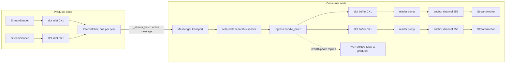
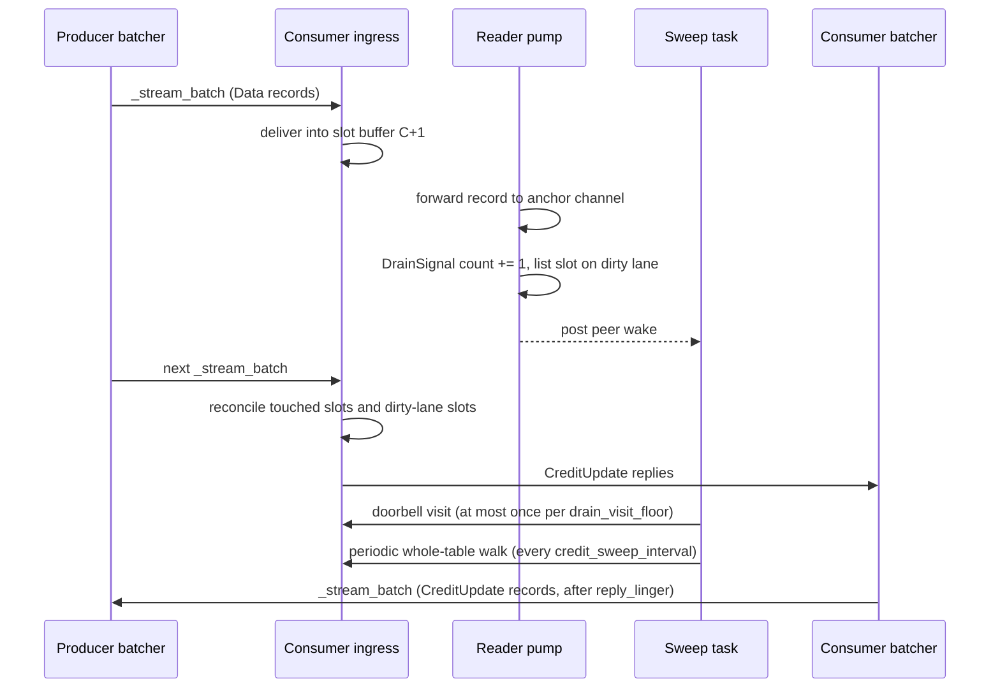

# Batched streaming

The messenger mux carries every stream to one peer over the Messenger connection that already exists to that peer. It packs the records for that peer into `_stream_batch` active messages. Its transport key is `messenger-mux-v1`. The mux is on by default and is negotiated per attach. Senders do not change: `StreamSender::send` stages a record, and the layer below it decides when to write.

This chapter describes how the mux works. The [Tune batched streaming](../guides/tune-batched-streaming.md) guide tells you how to configure it. The [Batched streaming design](../development/batched-streaming-design.md) chapter records why it works this way and which alternatives were rejected.

## Why one connection per stream does not scale

Without the mux, a velo stream owns a connection. The consumer creates a `StreamAnchor`, the producer attaches to its `StreamAnchorHandle`, and `FrameTransport::connect` returns a channel over a dedicated TCP connection. This design is correct for a few long-lived bulk streams. Each stream gets its own socket, its own kernel buffers and its own failure domain.

LLM serving has a different shape. A decode engine holds X requests in flight and emits one token per request on each forward pass. The X anchors belong to a small set of Y frontends. In a typical disaggregated deployment X is 256 to 1,024 and Y is 4 to 16. Each forward pass therefore makes X writes and X TCP segments, where Y writes carry the same payload.

Each remote stream on the per-stream path costs the following:

| Resource | Cost per stream |
|---|---|
| Sockets | 1 socket, 2 file descriptors (one per side) |
| Socket buffers | 1 MiB send and 1 MiB receive requested at each end (Linux doubles the request) |
| Channel slots | 4,096 on the connect side, 4,096 on the bind side |
| Tokio tasks | 4: heartbeat, egress pump, accept pump, reader pump |
| Setup latency | 1 active-message round trip plus 1 TCP dial round trip |

Per token, the stream pays one `rmp_serde` allocation, one channel hop, one `encode_frame` and, because `TCP_NODELAY` is set, one syscall and one TCP segment.

This cost is a ceiling, not a slope. Each remote stream holds one socket, with one file descriptor in each of the two processes. Across both ends, 1,024 concurrent remote streams need 2,048 descriptors, about 4 GiB of requested socket buffer and about 4,096 tasks. Each process holds one descriptor per stream. At the default `ulimit -n` of 1,024, a process stops below 1,024 concurrent remote streams, less the descriptors that it uses for other things.

The rate of new streams is a limit too. On a cluster (2026-09-23, two Grace nodes on 200G Ethernet, 512 mock workers in 8 processes, concurrency 8,192), a response plane that opened about 2,500 streams per second on the per-stream path failed 80% to 92% of its requests. The workers could not get a local port (`Cannot assign requested address`). The mux carried the same load with no errors. For this reason the mux is the default.

### Per-stream coalescing cannot reach the forward-pass shape

The per-stream egress pump packs every frame already queued on its stream into one write. The test `lib/velo/tests/streaming/tcp_batching.rs` measures this on TCP loopback. The ratio is `velo_streaming_frames_written_total` divided by `velo_streaming_egress_flushes_total`.

| Workload | Frames | Egress flushes | Ratio |
|---|---|---|---|
| One stream, 20,000 frames back to back | 20,001 | 21 | 952 : 1 |
| 32 streams, 1 frame per stream per pass | 3,232 | 3,232 | 1.00 : 1 |

A forward pass puts one frame on each of X different streams. Each pump wakes with exactly one frame, so per-stream coalescing does nothing. The frames are on the wrong axis. Only bucketing by destination worker reaches them. The test `forward_pass_shape_does_not_coalesce_per_stream` asserts this limitation, so it fails if per-stream coalescing is ever mistaken for a solution.

## Design overview

The mux has four mechanisms:

1. **Multiplexing.** Every stream to a peer becomes a slot on the Messenger connection to that peer. Streaming owns no sockets.
2. **Batching.** Many records go into one active message and one `write_all`.
3. **Flow control.** Per-slot credit keeps one slow consumer from stalling the shared ordering lane of its peer.
4. **Flush policy.** A policy decides when the batcher writes.

Bucketing by destination costs nothing. `StreamAnchorHandle` packs a `WorkerId` into its upper 64 bits, and `WorkerId` is a 1:1 hash of `InstanceId`. `handle.unpack().0` is the batching key, with no map lookup and no discovery hop.



## Protocol

### Riding the Messenger

`MessengerMuxTransport` implements the streaming `FrameTransport` contract. It has no dial, no listener, no acceptor and no connection manager. The sender's identity arrives in the active-message envelope, so credit has a return route without a handshake.

Egress is one `PeerBatcher` per remote instance. The batcher is created on the first send to that peer and evicted when it is idle with no live slots. A node that talks to Y peers holds Y batchers, whatever its stream count. The per-stream design is O(X) in tasks and sockets. With the mux, sockets and batchers are O(Y). Each stream still has its own reader pump and heartbeat task, so tasks stay O(X).

The cost of this design is that streaming no longer owns its wire. It shares queues, framing and backpressure with control traffic. Stream order is no longer a TCP guarantee. It is a protocol obligation, and every record carries a per-slot sequence number for this reason.

### Frame envelope

A batch is the payload of one `_stream_batch` active message. The Messenger frames the active message, so the batch carries only its own header:

```text
_stream_batch payload:
  [16 B batch header][record_count x record]

batch header:
  [u8 mux_version = 1][u8 flags][u16 record_count][u64 peer_epoch][u32 batch_seq]

record:
  [u8 record_type][u32 slot][u32 frame_seq][u32 len][len bytes body]

record_type: 0 = Data, 1 = OpenSlot, 2 = CloseSlot, 3 = CreditUpdate, 4 = SlotHeartbeat
```

Every multi-byte field is big-endian, in the header and in each record. Senders write `flags` as zero, and receivers ignore unknown bits.

The sender bumps `peer_epoch` each time it re-establishes its view of the peer. `batch_seq` advances within an epoch and is compared modulo 2^32. Together they let ingress discard a stale epoch's batches by header inspection, and they meter gaps. `frame_seq` is per slot and is the authority on stream order.

Each record header is 13 bytes. On a 40-byte token that is about 33% overhead, against 9 bytes on a dedicated connection. The two sequence numbers pay for ordering that a private TCP connection gave for free.

Record bodies:

- **`Data`** carries the `rmp_serde`-encoded `StreamFrame` bytes, identical to the per-stream path. `is_terminal_sentinel()` works unchanged on a record body, so terminal detection has one code path.
- **`OpenSlot`** carries `[u64 anchor_id][u64 session_id]`. This is the 16-byte attach handshake, moved into a record.
- **`CloseSlot`** carries `[u8 reason]`: `0` terminal sent, `1` peer gone, `2` unknown slot, `3` protocol error.
- **`CreditUpdate`** carries `[u32 delta]` from receiver to sender.
- **`SlotHeartbeat`** has no body. The decoder accepts it, but no sender emits it. See [Heartbeats](#heartbeats).

`CloseSlot` travels in both directions and has no direction bit. The reason carries the direction. `TerminalSent` and `PeerGone` travel from slot owner to receiver. `UnknownSlot` and `ProtocolError` travel from receiver to slot owner. Both sides can hold a slot at the same dense index, and the reason tells them apart.

### The batch size cap

Three numbers clamp a batch, and the smallest one binds:

- `MuxConfig::max_batch_bytes`, 60 KiB by default.
- The effective eager budget. This is the smaller of `Transport::max_message_size(target)` (where the transport reports one) and the rendezvous staging threshold, less the envelope overhead. It is the largest payload the Messenger carries inline to that peer.
- `COALESCE_THRESHOLD`, 64 KiB. The coalescing writer packs a frame into its buffered `write_all` only if the frame fits under this threshold. A larger frame is written in segments, which gives back the syscall saving.

A batch over the eager budget does not fail. It becomes a rendezvous transfer and pays a round trip for every slot packed into it. The cap exists to keep batches eager.

A single record larger than the eager budget goes through rendezvous alone, in its own batch. Other slots continue in eager batches while that transfer is in flight. [Ordering](#ordering-is-per-slot) describes how the slot stays in order.

### Slots

```text
SlotId = (u24 index, u8 generation), packed into a u32, scoped by the sender's peer epoch

  bits 31..8 : index        bits 7..0 : generation
```

The index sits in the high bits so that the raw `u32` sorts by index. A dense index makes demux a `Vec` lookup instead of a hash. A 60 KiB batch holds about 1,100 records, so this lookup is on the hot path.

The generation is a correctness requirement. Without it, a stale record for a reused index goes to the stream that now holds that index. Request A's tokens then appear in request B's response, silently. Ingress drops a record whose generation does not match the current occupant and meters it in `velo_streaming_mux_generation_mismatch_total`.

The epoch scopes the whole table above the generation. A generation survives slot reuse within one sender's lifetime. The epoch survives the sender itself. Ingress therefore discards batches from an old epoch as a whole, and a `u8` generation is enough.

### Ordering is per slot

The mux registers `_stream_batch` with ordered per-sender dispatch. One task handles the batches from one peer, in arrival order. The general reordering problem does not arise, and no reorder window is necessary.

One exception exists. A rendezvous payload resolves in a detached task before dispatch, so an oversized record is not ordered against the eager batches around it. Two mechanisms bound this:

1. **The egress fence.** A slot has at most one fenced singleton outstanding. While the fence is up, the batcher withholds the later records of that slot until the staged send is admitted. This includes the slot's `CloseSlot`, because a close must not overtake the record in front of it. Only the resolution of that singleton lifts its own fence. A rendezvous record always fences its slot, even when the transport admits it synchronously, because the receiver resolves it outside the ordered lane.
2. **The ingress hold.** Ingress keeps a record that arrives ahead of its `frame_seq` in a per-slot hold, and applies it when the gap closes. Credit admission and the slot and peer byte budgets bound the hold. An overflow closes that slot with `ProtocolError` and meters `velo_streaming_mux_hold_overflow_total`. The consumer sees `Dropped`. Other slots and the lane continue.

Batches from one peer must not be reordered. The worker writes each `OpenSlot` in its own batch. A `Data` batch that overtakes it finds no slot and is dropped as `closed_slot`. The slot then opens with its sequence past the lost record, which silently truncates the head of the stream.

### Opening a slot

The sender writes `OpenSlot` when the stream attaches, in a flush of its own. It does not wait for the first data record. `bind()` starts a 60-second accept window (`ACCEPT_TIMEOUT`). The window measures the time until a batch that carries the `OpenSlot` arrives. A lazy `OpenSlot` makes the window measure the time until the first token, and a queued request with a long prefill then expires.

An `OpenSlot` for an `(anchor_id, session_id)` pair that was never registered does not fail the peer. The receiver replies `CloseSlot{UnknownSlot}` and discards the records of that slot. When the accept window closes on an unclaimed bind, the reader pump reaps the registry entry, injects `Dropped` and increments `velo_streaming_unclaimed_bind_reaped_total`.

By default, `connect` returns after the transport admits the `OpenSlot`. `MuxConfig::async_open_ack` changes this. The `OpenSlot` still goes out in a batch of its own before `connect` returns, but the acknowledgement does not wait for admission. If the transport admits the frame synchronously, per-target FIFO already orders the slot's later records behind it, and no fence goes up. Otherwise the slot is fenced until the admission resolves. A failed admission is epoch death in both modes. Measured at load, this option did not improve first-token latency. See [Response plane performance](../operations/response-plane-performance.md).

### Zero-RTT stream setup

The receiver chooses every field of the attach response without input from the sender. It can therefore bind a slot before any sender asks. `AnchorManager::prebind_anchor` does the work of the attach handler at request registration. It binds the slot, allocates the routing session, takes the drain signal and spawns the reader pump. It returns a `StreamOpenTicket` with the five values an attach response carries. The application puts the ticket in the request envelope that it already sends to the worker.

The worker calls `AnchorManager::open_anchor_stream` with the ticket. Its first batch carries an `OpenSlot`, which claims the pre-bound slot the same way an attached sender's does. No `_anchor_attach` crosses the wire. The wire format does not change: `StreamOpenTicket` is a separate type in the application's envelope. When no mux is installed, `prebind_anchor` returns `None` and the stream attaches the ordinary way.

The pre-bind has these rules:

- **An attach adopts an unclaimed pre-bind.** A sender that attaches the ordinary way receives the waiting slot and the ticket's session id. An attach against a pre-bind whose `OpenSlot` already arrived is refused. A sender that does not offer the pre-bound key is refused, and the pre-bind is released.
- **A same-worker attach releases an unclaimed pre-bind.** A same-worker sender writes into the anchor channel directly and never claims the slot.
- **A dead request gives the bind back.** `PreBind`'s `Drop` releases an unclaimed bind. Every path that kills an anchor removes its registry entry, so this needs no extra call site.
- **Cancellation posts a close.** A zero-RTT anchor never learns a `StreamCancelHandle`. When a claimed pre-bind drops, it posts `CloseSlot{UnknownSlot}` to the producer through `close_claimed_slot`. An idle producer learns of the cancel without sending another record.
- **Detach gives the slot back.** Both places that handle `Detached` release the pre-bind and resume the unattached timer.

The ticket can wait in an envelope for the full 60-second accept window. Heartbeat detection starts only when the `OpenSlot` that claims the bind arrives. Before that, the reader pump does not count a silent window as a miss.

Credit is exact by construction. `prebind` sizes its buffer from the same `NegotiatedLimits` that the ticket quotes. `open_slot` emits no `CreditUpdate` on the claim, so the sender never holds 2C credit against a C+1 buffer.

The rollback is not symmetric. Disable the mux on the minting side first, or on both sides together. A producer that disables the mux alone still advertises its default transport key. A consumer that still pre-binds refuses that attach, because the key does not match the pre-bind.

The rollout has the same asymmetry in reverse. The mux is on by default, so a consumer mints tickets as soon as it runs a version with the mux. A producer without the mux cannot open them. Upgrade the producers first, or keep the mux off on the consumers that mint tickets until every producer has it.

### Peer loss

Loss of Messenger connectivity, peer eviction and batcher eviction all end in epoch death. Every live slot in the dying epoch that has not seen a terminal receives an injected `StreamFrame::Dropped`. The consumer sees `StreamError::SenderDropped`, the same as on the per-stream path. `TransportError` stays reserved for protocol violations. A reconnect bumps the epoch, and slots do not survive it. As a result, each failed live slot gets exactly one `Dropped`.

Any failed admission of a batch is also epoch death. A batch that never reached the wire leaves a `frame_seq` gap in every slot it carried. The mux does not retransmit, so those slots cannot make progress again.

## Flow control

The shared resource is the ordering lane of the peer. A `_stream_batch` handler that awaits holds that lane, and every slot from the peer stalls behind it. Lane channels are unbounded, so a blocking handler turns backpressure into unbounded memory growth. With a blocking handler, one saturated anchor stalls every stream from that peer and fires all of their heartbeat watchdogs at once. For inference, one slow HTTP client then throttles the GPU. Ingress is therefore bounded and nonblocking, on per-slot credit.

### Credit against a mux-owned buffer

Credit is issued against a mux-owned per-slot buffer, never against the anchor's `frame_tx`. `frame_tx` has other writers: the same-worker attach path, the detach and finalize handlers, the watchdog's `Dropped` injection and M concurrent MPSC senders. Any proof of "C credits against a C-deep channel" fails when a second writer exists. `bind` returns a receiver of depth C+1, and the reader pump moves each record from it into `frame_tx`.

Invariant: a slot never has more than C data records outstanding against its C+1 buffer. The ingress handler only calls `try_send` into space that credit already reserved, and it never blocks the lane. `velo_streaming_mux_reader_stall_total > 0` is a bug, not a tuning signal.

The initial credit C is negotiated. The receiver advertises `initial_credit` and `slot_byte_budget` in `AnchorAttachResponse::Ok` and in the MPSC equivalent. A slot opens already holding that window, so no round trip occurs before the first token. Continuing credit returns ride `CreditUpdate` records.

Each slot reserves one credit that only a terminal sentinel can spend. Data spends only C. One reserved credit is enough because `sent_terminal` allows at most one terminal per slot. `SenderError` is not a terminal and spends data credit. Control records (`OpenSlot`, `CloseSlot`, `CreditUpdate`) do not occupy the buffer, so data exhaustion never blocks them.

### Byte budgets

Frame credit alone bounds memory at slots × C × the maximum frame size, which is not a useful bound. The per-stream socket enforced about 1 MiB per stream for free. The mux shares one connection, so it enforces its own limits:

- `MuxConfig::slot_byte_budget`, 1 MiB per slot by default.
- `MuxConfig::peer_byte_budget`, 8 MiB per peer by default.

Frame credit proves that no head-of-line blocking occurs. Byte credit bounds memory. The two grants can disagree, for example C records of 1 MiB each against a 1 MiB slot cap. The byte side wins by withholding the next grant while the slot is over its byte watermark. It does not refuse a record whose frame credit was already granted. The ingress hold is the one place where a byte reservation refuses a record, because the alternative is unbounded growth behind a gap.

### Egress: the withheld queue

`finalize`, `detach` and `Drop` reach the slot inlet from synchronous code. The batcher therefore drains every inlet, whether or not the slot has credit. A slot with no credit keeps its records in a per-slot withheld queue, which the slot byte budget bounds. The queue is FIFO, so a terminal in it still waits for the records in front of it.

A producer that runs past the byte cap on a slot that nobody drains loses that slot. The producer's channel returns errors at once, the consumer receives `Dropped`, and `velo_streaming_mux_records_dropped_total{reason="withheld_overflow"}` increments. Other slots continue. [Stream saturation](../operations/saturation.md) describes this kill from the operator side.

The batcher's own control inlet is coalesced state, not a queue. Credit returns accumulate into a `u32` per slot. A close supersedes the credit of its slot, and a failed singleton supersedes a successful one. The batcher is woken, never fed. A queue is unbounded exactly when a flush parks on admission, which is when the peer is busiest returning credit.

Each control map is bounded by what the batcher allocated, not by a size cap. One map holds the control that a peer sends about this side's slots. It accepts a key only for an index that this batcher opened, at its live generation. A key for an index never allocated is refused and counted in `velo_streaming_mux_control_refused_total`. A key for a retired generation is dropped silently, because that is an ordinary close-then-reopen race. Replies that this side's ingress writes for slots it admitted are never refused. Rejections of an `OpenSlot` that ingress never admitted go on a separate reject lane, capped at 8,192 entries. A dropped rejection costs no credit, which is why a cap is safe there and nowhere else.

### Admission

Transports expose an ordered per-target admission gate as `SendOutcome::{Admitted, Pending(SendAdmission)}`. A batcher learns at the send site, in order, that its peer is congested, and parks itself instead of a runtime worker. A batcher parked on admission stops draining its inlets. The producer then waits on a full inlet. This wait is bounded by the progress of the transport, which is the same position a socket was always in.

### Credit return

Credit comes back from three paths. Two of them visit only slots that something named. The third walks the whole table as a backstop.

- **Drain signal.** When the reader pump forwards a record into the anchor channel, it increments an exact count on the slot's `DrainSignal`. On the first drain after a reconcile, it puts the slot index on a bounded per-peer dirty lane and posts the peer. The pump takes no lock.
- **Arrival path.** On every inbound batch, `handle_batch` reconciles the slots that the batch delivered into and the slots on the dirty lane. The credit that a stream's tail waits for rides the peer's next batch, which arrives in tens of microseconds.
- **Doorbell.** The sweep task answers a peer wake by reconciling the slots on its dirty lane. `MuxConfig::drain_visit_floor` (2 ms by default) limits it to one visit per peer per floor. This path covers a peer that sends no further batches.
- **Periodic tick.** Every `MuxConfig::credit_sweep_interval` (200 ms by default), the sweep walks every slot of every ingress peer. This covers a slot whose drain found the dirty lane full. The same tick evicts idle batchers.

The dirty lane carries an index and no quantity. The quantity is the count on the slot's own `DrainSignal`, and `IngressSlot::reconcile` swaps it to zero. A redundant visit therefore finds a count of zero and grants nothing. The three paths can run concurrently without double-counting. A lost or stale lane entry costs a visit, never credit.



Credit for a record returns when the record reaches the anchor channel, not when it enters the mux buffer. Anchor backpressure therefore reaches the sender one hop sooner.

A producer that ran out of credit sends no batches, so the arrival path does not run for its slots. It waits for the doorbell floor and then for the reply linger. Per record this costs `(drain_visit_floor + reply_linger) / initial_credit`. At the defaults (2 ms, 1 ms and 256) that is under 12 µs per record.

The periodic walk does not reclaim credit for a slot whose pump died, because a dead pump counts no drains. The next record that arrives for such a slot finds its receiver gone and closes the slot with `UnknownSlot`.

### Reply linger

A `CreditUpdate` does not write a batch of its own. `MuxConfig::reply_linger` (1 ms by default) starts when a reply with no window already running joins the batch. The window belongs to that reply. A record that joins later does not cancel it.

What ends the wait early depends on the flush policy:

- Under `Auto { on_admission: true }`, any record that is not a credit reply ends the wait. A batch that holds only replies waits out the window, or until a close, a terminal or an application flush.
- Under `Manual` and `Auto { on_admission: false }`, ordinary staging does not end the wait. Data that joins a pending reply is written with it when the window ends.
- Under every policy, opening a slot on the peer ends the wait, because `OpenSlot` has its own flush.

No policy holds a reply past its window. A reply held for good starves the peer's sender, and no application on this side knows that it owes the peer anything. `Duration::ZERO` makes each reply urgent again. `CloseSlot` replies are always urgent.

## Terminal sentinels

On the per-stream path, the egress pump writes a terminal, discards anything queued behind it and closes the socket. A frame sent after a terminal races the consumer's cleanup. The mux keeps this rule, scoped to one slot:

1. Egress sees `is_terminal_sentinel(body)` for slot S, appends the record to the current batch, marks S draining and drops the inlet receiver of S. Frames queued behind the terminal for S are discarded. Other slots continue.
2. Egress appends `CloseSlot{TerminalSent}` in the same batch, right after the terminal. Terminal and close are atomic.
3. The batcher frees the slot, bumps its generation and releases its credit and byte budget. The peer batcher and the peer's ordering lane continue.
4. On the receive side, the terminal spends the reserved credit. Then `CloseSlot` drops the mux-side sender, and the reader pump exits on the same closed-channel branch as when a socket closes.
5. A `CloseSlot` with any reason other than `TerminalSent`, and every epoch death, injects `Dropped` for a slot that has not delivered a terminal.

`finalize`, `detach` and `Drop` hand the terminal to the inlet without blocking a runtime worker. They call `try_send` first. On a full channel, they hand the record to a task that awaits space. The task holds a clone of the sender, so the channel stays open until the sentinel is in it. With no runtime on the thread, they block, because no worker exists to starve. `detach` clears the attachment flag only after the sentinel is in the channel, so a re-attach cannot put records ahead of the `Detached` frame.

`velo_streaming_mux_live_slots` must return to zero at teardown. A leaked slot holds credit and byte budget for the rest of the epoch, and unlike a leaked socket it does not show in `lsof`.

## Heartbeats

Each `StreamSender` runs a heartbeat task. The task ticks at the heartbeat interval that the consumer advertised and calls `try_send` with a `StreamFrame::Heartbeat` into the sender's channel. On a full channel the heartbeat is dropped. Under the mux, a heartbeat is an ordinary `Data` record. It spends data credit and shares the peer's queues with data.

The reader pump detects silence. It arms one pinned timer per stream. On each received frame, it stamps the time after the forward completes. It moves the deadline only when the deadline is within half a window. Under steady traffic the timer never fires and moves at most twice per deadline. When the timer fires with no frame inside the window, the pump counts a miss. After `DETECTION_MULTIPLIER` misses (3 × 5 s at the manager default), it injects `Dropped` and increments `velo_streaming_heartbeat_watchdog_firings_total`.

A per-stream heartbeat does not detect a hung producer, because it runs on a separate task. It detects process or host death, connection death and sustained saturation. Saturation shows because a full channel drops heartbeats. Under the mux, the Messenger already detects process, host and connection death, and the mux learns of it through epoch death. The one signal a stream heartbeat still carries is per-slot saturation. For this reason heartbeats are not in the reserved control class.

The wire reserves `SlotHeartbeat` (record type 4) for a cheaper heartbeat. In that design, the batcher emits it only for idle slots, on one peer-level tick. Ingress decodes and applies it, but no sender emits it yet. The [Batched streaming design](../development/batched-streaming-design.md) chapter records that design.

## Flush policy

Senders stage records, and the peer batcher decides when to write. The policies differ only in who decides.

| Policy | Trigger | Added latency | Default |
|---|---|---|---|
| `Auto { on_admission: true }` | End of every wake, after the batcher takes everything already queued | None (up to `reply_linger` for a batch of only credit replies) | Yes |
| `Auto { on_admission: false, max_linger: Some(w) }` | Up to `w` after the oldest staged record | Up to `w` | No |
| `Manual` | `Velo::flush_batch()` | Set by the caller. A pending credit reply takes the batch out after `reply_linger`. | No |

`AutoFlush` is a struct, not more enum variants, because its two conditions compose. A batcher can hold both. `on_admission` is named for its mechanism. A flush parks until the transport admits it, so "at the end of every wake" means "as soon as the peer took the last batch". The default cannot make latency worse. The batcher never waits for work that has not arrived. It only takes everything that is already queued.

Two conditions write a batch under every policy:

- **A batch at a clamp goes.** The byte cap, the record cap and the eager budget each cut a batch where they bind. A full batch gains nothing by waiting.
- **Records that carry liveness go.** `OpenSlot` has its own flush on the awaited path. A `CloseSlot` or a terminal makes its batch urgent. A `CreditUpdate` goes within `reply_linger`.

A slot with no credit also cuts a batch: it adds nothing, and its records wait in the withheld queue.

### The flush API

```rust
for (sender, token) in outputs {
    sender.send(token).await?;   // stage
}
velo.flush_batch();              // one write per peer
```

`flush_batch()` is synchronous and does not block. It kicks each batcher and returns. It is not a backpressure point: per-slot credit and transport admission slow a producer, the same as when nobody calls it. It takes no argument, because a producer holds `StreamSender`s and cannot know which batcher each one feeds. It is valid under every policy and never returns an error. Under `Manual` it is the write. Under `Auto` it forces a write before the batcher's own conditions. With no mux installed it does nothing.

A burst between two calls is a hint, not a frame boundary. A clamp or a liveness record can cut a wire batch inside the burst. A caller must not assume that the records it bracketed arrive in one `_stream_batch`.

The kick survives a clamp. A wake that stages 100 records can hit a clamp at record 60 and flush inline. The kick stays set, and the batcher consumes it at the end of the wake, after it writes the other 40.

### Why a call and not a guard

An earlier design used an RAII gate: `start_batch()` and `end_batch()` around a `StreamBatch` guard, reference-counted for nesting, flushing on `Drop`. The call replaces it:

- **No open state.** A gate can be held across an `.await`, which made a deadlock possible and required two rules to prevent it. A flush holds nothing and nests nothing.
- **No guard type.** One method replaces a guard, wrapper functions and a reference count.
- **It fits the loop.** A forward pass is imperative: stage the sends, flush, start the next pass.

The deadlock that the gate rules existed for cannot occur. A producer that sends C+1 frames to one slot has frames 1 to C staged and frame C+1 in the withheld queue. The flush that returns credit is one the producer makes itself, at the end of the pass.

### The failure mode of Manual

Under `Manual`, the application's own records that are staged after the last `flush_batch` wait for the next call. No timer moves them. This is what makes "one write per pass, carrying that pass" a property of the code and not of the scheduler. The usual cause is a producer that stopped calling `flush_batch`. A slot starved of credit is a second case: a grant that arrives after the flush releases withheld records into the next pass's batch. A terminal and an inlet close move on their own, so the end of the stream bounds this case.

The cost is latency, not memory, because the same clamps bound staged records. `velo_streaming_mux_staged_records` shows a plateau. A deployment that wants a safety net can configure `Auto { on_admission: false, max_linger: Some(w) }`, which is the same batching with a window.

### When an explicit flush helps

A forward pass that sends to X streams with no `.await` between the sends puts them all in the shared egress queue. The default policy then sees all of them. A producer that awaits between sends (a tokenizer, a sampling callback, anything that yields) delivers each send to the batcher alone, and the ratio falls toward 1.0. Only an explicit flush groups sends that the runtime scheduled apart.

The second reason is determinism. How many records share a batch under `Auto` depends on how the runtime scheduled the batcher against the producer. The `batched_streaming` example (three anchor hosts, two engines, loopback TCP, 20-core arm64 machine) shows the difference in tokens per wire write:

| Configuration | Legacy per-stream | `Auto` (5 runs) | `Manual` (5 runs) |
|---|---|---|---|
| 24 requests, max batch 8, 1 ms between passes | 0.99 to 1.00 | 2.18 to 2.19 | 2.19 every run |
| 96 requests, max batch 32, 1 ms between passes | not run | 4.67 to 5.14 | 5.38 every run |
| 24 requests, max batch 8, no gap between passes | not run | 6.61 to 7.44 | 3.47 to 4.41 |

At serving depth, `Manual` is both higher and repeatable. A batcher that writes at every wake sometimes wakes mid-pass and writes half a pass. `Auto` packs harder only when the producer outruns the batcher with no gap between passes. That surplus is throughput bought with per-token latency, which is the wrong trade for a decode engine. Use `Auto` to let the batcher do its best with what it finds. Use `Manual` to know what it will do.

## Negotiation and compatibility

The attach selects the mux. No wire magic exists. `AnchorAttachRequest` and `MpscAnchorAttachRequest` carry `supported_transport_keys` (with `#[serde(default)]`, so an older sender deserializes as advertising nothing). The attach handler intersects the sender's keys with its installed transports. It picks `messenger-mux-v1` only when both sides name it. Otherwise it answers with its default key.

The sender reads the answer:

- A key other than `messenger-mux-v1` is the per-stream path, and the credit fields do not apply. Every older receiver answers this way.
- `messenger-mux-v1` with a window opens a slot that already holds that window.
- `messenger-mux-v1` with no window (`initial_credit` zero) is refused. No shipped receiver answers this, and a node with a mux cannot advertise a zero window. A fallback to another transport reaches nothing that listens, and the stream hangs until the watchdog fires.

A node with the mux enabled registers both `messenger-mux-v1` and its configured per-stream transport, so it still serves older peers. `resolve_transport` fails on an unknown key in a non-empty registry, so a receiver that answers the mux on its own breaks every older sender. SPSC and MPSC anchors both negotiate the mux.

`StreamSender::negotiated_transport()` returns the key that the attach settled on. It returns `None` for a same-worker attach, which uses no transport. Compare it with the public constant `MESSENGER_MUX_KEY`.

`MuxConfig::enabled = false` is the rollback. The node stops advertising `messenger-mux-v1`, and the next attach negotiates the per-stream path with no code or wire change. See [Zero-RTT stream setup](#zero-rtt-stream-setup) for the order when tickets are in use.

## Observability

The mux series all start with `velo_streaming_mux_`. The most important ones:

- `velo_streaming_mux_records_per_batch{direction}` and `velo_streaming_mux_batches_total{direction}` show how much batching occurs.
- `velo_streaming_mux_live_slots` returns to zero at teardown.
- `velo_streaming_mux_reader_stall_total` and `velo_streaming_mux_credit_lost_total` must stay at zero.
- `velo_streaming_slot_credit_exhausted_total` counts credit starvation on the sender.
- `velo_messenger_ordered_lane_wait_seconds{handler="_stream_batch"}` shows the ingress lane wait, one sample per batch.

The [Metrics reference](../appendix/metrics.md) lists every series. [Stream saturation](../operations/saturation.md) explains how to read them under load.
