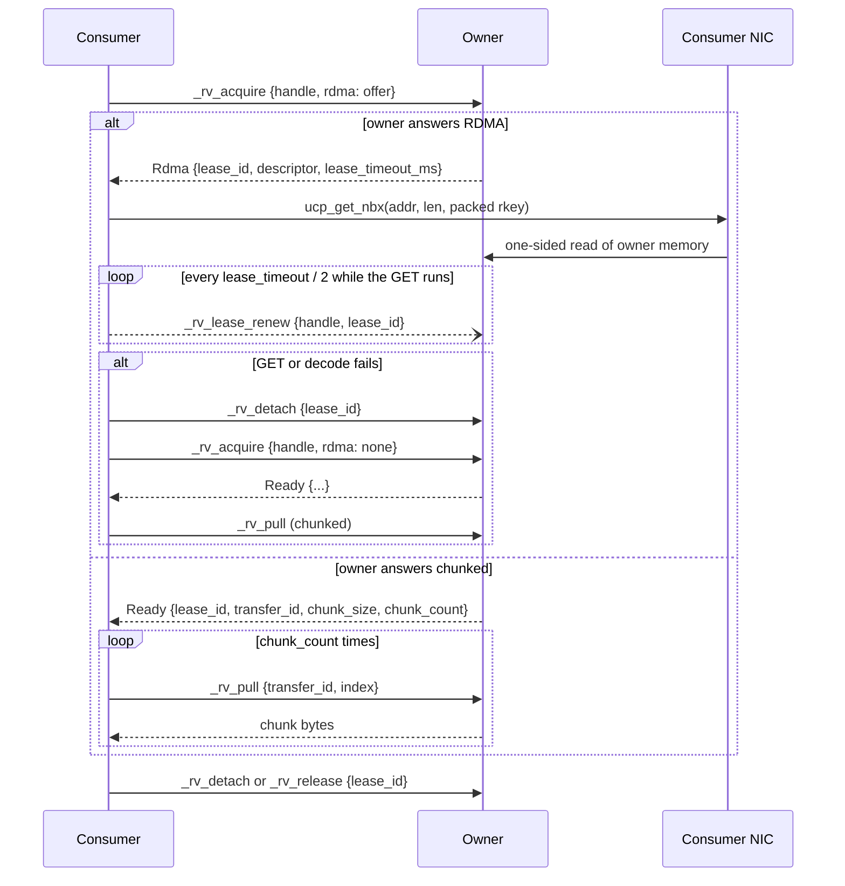
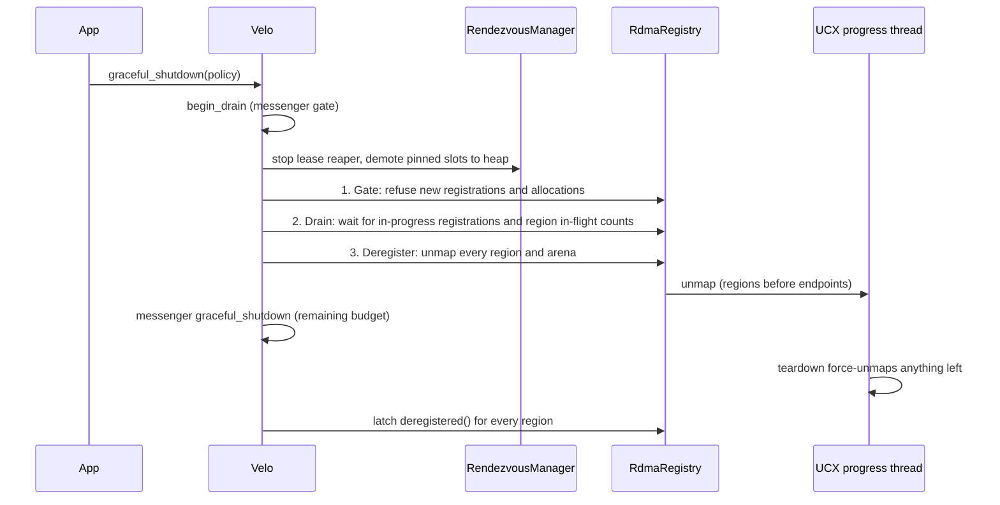

# Rendezvous and RDMA

Rendezvous moves a large payload by handle. One worker (the *owner*) stages the bytes and gets a compact `DataHandle`. The owner passes the handle to consumers by any means: a message field, an event, or a typed response. Each consumer then pulls the bytes from the owner. The consumer drives every transfer. The owner only answers.

The bytes move on one of two paths. The **chunked path** works everywhere and pulls the payload in 512 KiB messages. The **RDMA path** lets the consumer's NIC read the owner's memory with one UCX `ucp_get_nbx` call. The owner decides the path for each transfer, and a caller writes the same code for both.

The RDMA path needs the `ucx` feature on Linux. See [Run rendezvous over RDMA](../guides/ucx-rdma.md) for the build and the runtime setup. See [RDMA performance](../operations/rdma-performance.md) for measured numbers, and [RDMA design](../development/rdma-design.md) for why the design has this shape.

## The handle API

| Call | Side | Effect |
|---|---|---|
| `register_data(bytes)` | owner | Stage bytes in plain memory. Refcount 1. |
| `register_data_pinned(&[u8])` | owner | Copy bytes into RDMA-registered pool memory. Never fails. |
| `register_data_in_region(&guard, range)` | owner | Stage a range of caller-registered memory with no copy. |
| `metadata(handle)` | consumer | Size, refcount, and `pinned`. Takes no lock. |
| `get(handle)` | consumer | Take a read lock, move the bytes, return `(Bytes, lease_id)`. |
| `get_pinned(handle)` | consumer | Same, but return a `PinnedBuf` in registered memory with no copy out. |
| `get_into(handle, &mut dest)` | consumer | Same, into a caller buffer. A `PinnedWriter` destination gets a zero-copy GET. |
| `ref_handle(handle)` | consumer | Add one reference, for one more consumer. |
| `detach(handle, lease)` | consumer | Drop the read lock. The handle stays usable. |
| `release(handle, lease)` | consumer | Drop the read lock and one reference. The owner frees the slot at zero. |

A handle is a `u128`: the owner's `WorkerId` in the upper 64 bits and a local slot id in the lower 64. Serde writes it as `{hi, lo}` because MessagePack has no clean `u128` encoding.

The owner registers seven handlers: `_rv_metadata`, `_rv_acquire`, `_rv_pull`, `_rv_ref`, `_rv_detach`, `_rv_release`, and `_rv_lease_renew`. The control plane uses JSON over ordinary messenger calls, so any transport carries it.

## One transfer, both paths

`_rv_acquire` takes the read lock and chooses the path in the same round trip.



Both answers end in the same `detach` or `release`. The owner checks the registration again at every acquire, so no cross-node invalidation protocol exists.

## When the owner answers RDMA

The owner answers `AcquireResponse::Rdma` only if every check below passes. The checks run in this order. Each refusal increments `velo_rendezvous_rdma_path_total{path="chunked", reason=...}` on the owner.

| # | Check | Reason label on refusal |
|---|---|---|
| 0 | The owner is not draining. The shutdown sweep that follows a drain frees pinned memory. | `draining` |
| 1 | The consumer sent an RDMA offer. | `no_offer` |
| 2 | This instance has an RDMA registry (UCX was added with `add_ucx_transport`). | `not_configured` |
| 3 | The RDMA path is enabled on this owner (the kill switch is off). | `kill_switch` |
| 4 | The slot is staged in registered memory. | `not_pinned` |
| 5 | The payload is at least `rdma_min_bytes` (64 KiB by default). | `below_min` |
| 6 | The offer names the backend this owner serves (`"ucx"`). | `no_offer` |
| 7 | The staging still exists and the descriptor encodes. | `not_pinned` |

Check 7 catches an external region that was deregistered under the slot.

Only a lease answered with a descriptor gets a deadline. Chunked leases have no deadline.

### What the consumer offers

The consumer builds its offer from three local facts. It asks the owner nothing.

- This instance has an RDMA registry.
- The kill switch on this instance is off.
- The owner is registered on a transport whose key matches the registry backend.

The GET uses this consumer's own UCX endpoint to the owner. So "UCX is registered for that peer" is the whole condition. UCX does not have to be the primary transport. The expected deployment is a TCP control plane with UCX beside it.

The rule has a cold-start effect. A peer that is not registered yet translates to nothing. The first `get` to an unknown owner therefore offers nothing and pulls chunks. Later gets take the RDMA path.

## Fallback is a routing decision

After the owner sends a descriptor, four failures can occur on the consumer. They map to three reason labels:

| Failure | Reason label |
|---|---|
| The descriptor does not decode, or it names a backend this consumer does not have. | `decode_error` |
| The consumer cannot get a registered destination buffer. | `pool_exhausted` |
| The GET fails. | `get_failed` |

For each failure, the consumer detaches the lease, acquires again with no offer, and pulls chunks. This always works, because a pinned slot also serves the chunked path.

The fallback happens **exactly once**. The second acquire carries no offer, so an owner that answers it with another descriptor is broken. The consumer returns an error in that case. A retry loop turns one bad owner into an unbounded storm of round trips.

**A pinned slot is never RDMA-only.** Old consumers, consumers without UCX, consumers below the threshold, and consumers whose GET failed all read the same slot by chunks. The owner does not need to know in advance which kind of consumer it talks to.

## Staging on the owner

### `register_data_pinned`

This call copies the bytes into a pool buffer that the NIC can read. It returns a `DataHandle`, not a `Result`. If the pool cannot give memory, the call stages the bytes in plain memory and records why:

- The registered-bytes budget is spent: `budget`.
- The pool cannot allocate for another reason: `pool_exhausted`.
- The kill switch is on: `kill_switch`.
- The instance has no UCX transport: the data goes to plain memory.

Zero-length data always goes to plain memory, because a GET has nothing to transfer. The call always costs one copy. The zero-copy form is `register_data_in_region` over memory that the caller registered.

### `register_data_in_region`

This call stages a range of memory that the caller already registered with `register_external_memory` or `register_owned`. The range is relative to the registered pointer, not to the page-rounded effective range. A caller therefore cannot name a byte that is inside the registration but outside its own allocation.

The call returns a `Result`. A fallback to plain memory copies bytes that the caller asked velo not to copy. The kill switch does not affect staging here. It only decides whether `_rv_acquire` answers with a descriptor.

The slot holds an in-flight guard on the region. `RegionGuard::unregister` therefore waits for the anchors inside the region before it unmaps. The slot takes the guard first and then reads the region state. The reverse order leaves a gap in which the whole gate, drain, and unmap sequence can run.

Chunked reads of an external slot never form a Rust reference into the region. A peer holding the key can write the region at any time. The read copies with `ptr::copy_nonoverlapping` into a fresh buffer, under the region's copy gate, 512 KiB at a time. The copy gate orders each read against the deregistration latch. A copy in progress delays the latch. A copy that starts after the latch sees the flag and refuses.

### Transparent staging

The messenger stages any payload above 256 KiB through rendezvous and replaces it in the frame with a handle. The receiver resolves the handle before the handler runs, so handler code never sees the difference.

The transparent stager runs inside the synchronous `send_message`. It uses only arenas that the pool has already mapped. It never maps a new arena, because mapping is an `ibv_reg_mr` whose cost is linear in size. A send must not stall on that.

The result: **a process whose only staging is transparent never maps an arena and never takes the RDMA path.** One explicit `register_data_pinned` call maps the first arena. After that, transparent payloads use it. Growing the pool from a send on a background task was rejected. A caller cannot reason about a message send that causes a 64 MiB pin.

## Reading on the consumer

- `get` GETs into a pool buffer on the consumer, then copies into `Bytes` so the pool space returns at once.
- `get_pinned` returns the pool buffer itself. On the chunked path it copies the chunks into a pool buffer, so the return type is the same on both paths.
- `get_into` with a `PinnedWriter` (from `alloc_pinned_writer`) GETs straight into the caller buffer. Other `RendezvousWrite` destinations get a GET into a pool buffer and one copy.

The GET runs on a spawned task that owns the destination reservation (a `TransferHold`). If the caller drops the `get` future, the task keeps running and the granules stay reserved until the backend reports completion. Without this, a dropped future returns the granules to the free list while the NIC still writes into them.

## Leases and deadlines

The owner sees every chunk request, so it sees an abandoned chunked transfer stop. It does not see an RDMA GET, because the consumer's NIC issues it. Without a deadline, a consumer that crashes mid-GET holds the read lock and the refcount forever. So RDMA leases carry a deadline.

- `lease_timeout` defaults to 30 s. The owner sends it to the consumer as `lease_timeout_ms`.
- The owner reaper scans every `lease_timeout / 2`, with a 10 ms floor. A silent lease is force-released between one and one and a half timeouts after its last renewal.
- While a GET runs, the consumer sends `_rv_lease_renew` every `lease_timeout / 2`, with a 5 ms floor. A lost renewal is harmless, because the next one is half a deadline away.
- Renewal stops when the transfer ends. Holding an RDMA lease idle past its deadline is not supported. A caller that holds data across a long pause releases it and acquires again.

On the wire, `0` means "no deadline". A consumer that gets `0` starts no renewal ticker. A sub-millisecond `lease_timeout` therefore clamps to 1 ms at build time. Without the clamp, the owner arms a deadline that the consumer was told does not exist, and the lease never renews. The clamp makes small values defined, not useful. Renewals go out at most every 5 ms and the reaper scans at most every 10 ms, so values below about 100 ms reap live transfers.

## The descriptor

The RDMA answer carries a velo-owned binary descriptor, not JSON:

```text
backend:    u8      1 = ucx
version:    u8      1
flags:      u8      0
generation: u64le   owner's registration generation
addr:       u64le   owner-authored absolute address
len:        u64le   bytes to read
rkey_len:   u16le   length of the packed key that follows
rkey:       [u8; rkey_len]
```

The header is 29 bytes, then exactly `rkey_len` key bytes, then nothing.

The format is binary because the packed rkey goes to `ucp_ep_rkey_unpack`, which has no length parameter. A truncated or corrupt blob is an out-of-bounds read inside UCX, and no Rust wrapper can make that safe after the fact. The framing must therefore be exact and owned by velo.

Decoding refuses anything that it cannot account for byte for byte:

- an unknown backend or version
- a non-zero `flags`
- a zero `len`
- an `rkey_len` that disagrees with the bytes that follow
- any trailing byte

A refusal is not an error for the caller. It costs one extra round trip on the chunked path.

The key is bounded at 4096 bytes by the descriptor and at 1024 bytes by the UCX backend. The backend checks the bound at map time and again before unpack. Before any pointer reaches `ucp_ep_rkey_unpack`, the UCX backend also walks the two stages of the UCX 1.22 packed-rkey format. It refuses a blob unless UCX's own parse ends inside the blob, and it refuses an out-of-range `mem_type`. This pre-parse checks framing only. A stale key with perfect framing passes it. See [RDMA design](../development/rdma-design.md#a-stale-rkey-aborts-the-process-on-infiniband) for why that matters.

`generation` is in the descriptor for diagnostics. The consumer does not send it back in `detach` or `release`.

## Version skew

Two `#[serde(default)]` fields make a mixed-version deployment fall back to chunked instead of failing:

- `RvAcquireRequest::rdma` (the offer). An old owner ignores it and answers `Ready`. An old consumer omits it, and an owner that sees no offer never answers `Rdma`.
- `AcquireResponse::Rdma::lease_timeout_ms`. If a future owner omits it, the default `0` means no deadline, which is the old behavior.

The rule for new fields: every field is `#[serde(default)]`, and every default means what the protocol did before the field existed. A default that means "the new behavior" makes an old peer's silence look like consent.

## Memory registration

Velo registers memory in two ways. Both end in the same lifecycle.

### The arena pool

Velo sets `UCX_RCACHE_ENABLE=n` and `UCX_MEM_EVENTS=n` by default, so UCX installs no malloc hooks in the process. With those settings, every `ucp_mem_map` is a fresh `ibv_reg_mr` whose cost is linear in size, and UCX caches nothing. Pre-registered arenas are therefore required, not an optimization.

- The pool registers a few large arenas. Each arena is one page-aligned allocation, one `ucp_mem_map`, and one packed rkey.
- The first arena is 64 MiB (`initial_arena_bytes`). Later arenas grow geometrically up to 1 GiB (`max_arena_bytes`).
- Inside an arena, `offset-allocator` hands out 4 KiB granules in O(1). Its float bins waste at most about 12.5%.
- A request of 64 MiB or more (`dedicated_arena_min`) gets its own arena. Without this, the 12.5% round-up costs 128 MiB on a 1 GiB object.
- The suballocator node pool is sized to the granule count, about 28 bytes per granule (0.7% of the arena). A smaller node pool makes a fragmented arena report "full" while it still has room. The pool then maps an arena that it does not need.
- The free token (the private `Allocation` inside a `PinnedBuf`) and the wire descriptor are different values. A peer with a descriptor can read the range. It cannot free it, and the descriptor does not keep it alive.

`registered_bytes_budget` (1 GiB by default) caps mapped bytes across the pool and external regions together. It counts what the kernel pins: whole pages, reconciled to the effective range that UCX reports. A mostly empty arena costs its full size. Over the budget, pinned staging falls back to plain memory. Budget exhaustion is never a hard error.

Pages outlive their registration. Arena memory is freed only after the backend confirms the unmap. A registry torn down without its shutdown sweep leaks its arenas and logs at `error`. A leak is the safer failure, because freeing pages that UCX still pins is the hazard this layer exists to prevent.

### External registration

`Velo::register_external_memory(ptr, len)` registers memory that the caller owns and returns a `RegionGuard`. The function is `unsafe`. Until `RegionGuard::deregistered()` resolves, the caller guarantees all of these:

- `ptr` is valid for reads **and writes** of `len` bytes. Registering a read-only mapping is undefined behavior.
- `ptr + len` does not wrap.
- The allocation is not freed, moved, remapped, or reallocated.
- No Rust reference into the range exists. A peer can write at any time.

`Velo::register_owned(Box<[u8]>)` is the safe form. Velo holds the buffer until an unmap is confirmed. On failure, the buffer comes back inside `RegisterOwnedError`, because `BudgetExceeded` is a routine refusal and must not consume the allocation. `RegionGuard::unregister_owned` gives the buffer back after release.

The guard does not borrow. Its lifecycle:

- `deregistered().await` is the single release signal. It resolves on a confirmed unmap, or at the end of `graceful_shutdown`, whichever comes first. Only then can the caller free the memory.
- `unregister(timeout)` gates new use, drains in-flight work, and unmaps. It returns `Deregistered::Drained` or `Deregistered::DrainTimedOut`. **Both mean the memory is released.** `DrainTimedOut` means velo did not wait for in-flight work. An earlier `Err(Timeout)` shape mixed up "still mapped" with "unmapped early", and only the first means "do not free".
- `Drop` without `unregister` starts a background deregistration, logs at `warn`, and returns at once. It never blocks, because blocking in `Drop` inside a tokio runtime deadlocks the worker. The memory stays pinned until the background task finishes. An early drop is a liveness bug for the caller, not a soundness bug for anyone else.
- `watch()` returns a `RegionWatch`. It carries the same observers but does not own the release, because `unregister` consumes the guard.
- If the progress thread dies while the backend still reports registrations, `deregistered()` never resolves. Velo cannot prove the memory was released, so it leaks the memory on purpose.

### Registered means remotely writable

UCP has no enforced protection field. Any holder of a region's key can **write** the region, not only read it. The GET-only shape of the rendezvous protocol is a convention, not an enforcement. Registration pins whole pages, so bytes next to the allocation share the pinning and the remote writability. `RegionGuard::effective_range` reports what was pinned.

Registering memory is therefore a trust decision about the peers that this instance talks to. Key material only goes to peers that this instance already talks to. A `&mut [u8]`-shaped API is an aliasing lie, so velo does not offer one.

## Lifecycle pressure

Registrations are evicted by a byte budget, never by an inactivity timer. A timer that evicts a registration while a peer still holds its descriptor creates a stale key. On InfiniBand, a stale key aborts the process. No surveyed system (UCX rcache, libfabric, MPICH, NCCL) evicts registrations on a timer.

Two timers exist anyway, on objects that no peer can hold a reference to.

### Arena reclamation

One periodic sweep runs on the lease reaper's task. A second timer needs its own ordering against the first at shutdown.

- **Empty pooled arenas**, only when `arena_reclaim_after` is set (off by default). An arena with no suballocation has no live descriptor into it, so an unmap is safe. `retain_arena_bytes` (64 MiB by default) keeps a warm floor mapped, so an idle-then-busy workload does not pay a fresh registration. The sweep considers the newest arenas first, so the small first arena survives as the floor.
- **Empty dedicated arenas**, always, with no timer and no floor. A dedicated arena serves one request and is never offered again, so after its buffer drops it only consumes budget. Without this, a workload that stages 64 MiB objects repeatedly exhausts a 1 GiB budget after 16 of them and falls back to chunked for good.

The sweep period is the smaller of `lease_timeout / 2` and `arena_reclaim_after / 2`, with a 10 ms floor. An arena is unmapped between one and two `arena_reclaim_after` intervals after it becomes empty.

### Endpoint idle reaper

`UcxTransportBuilder::ep_idle_timeout(Some(d))` closes UCX endpoints that nothing used for `d`. It is **off by default and experimental.** Values below 500 ms rise to 500 ms, which is about 35 times the measured endpoint wireup.

- "Used" means both directions. Our sends, GETs, pings, and eager wireup stamp the endpoint. Inbound frames stamp it too, because UCX hands the receive callback the same endpoint pointer that `ucp_ep_create` returned.
- The reaper never closes an endpoint while an RDMA operation to that peer is outstanding.
- The scan runs every half timeout, and at least once per second. An endpoint closes between one timeout and one timeout plus one scan period after its last use.
- The next use wires up a new endpoint with no error. The peer stays registered.

**Closing an endpoint costs the peer.** UCX pairs endpoints by remote worker. The peer's own endpoint back to us rides the same connection. After a reap, the peer's next frame to us is admitted and silently lost, with no error at either end. UCX keepalive (about 20 s) then declares the peer's endpoint failed, and the frame after that arrives. The cost is one lost frame and up to one keepalive interval per reaped endpoint. The disruption self-heals.

Patterns where the reaper is safe: peers idle in both directions, and send-only fan-out. It is unsafe for peers that this instance only health-probes. Each probe creates an endpoint, and each reap costs the peer a frame. A send admitted just before its endpoint ages out can still be on the wire at the close. It fails through its `on_error` handler with the original buffers.

### Eager endpoint wireup

`UcxTransportBuilder::eager_endpoints(true)` creates the endpoint at `register()` instead of at first use. It is off by default. The first GET on a fresh peer pair costs about 14 ms of UCX wireup, against about 108 µs for a warm GET (measured on 2026-08-29, see [RDMA performance](../operations/rdma-performance.md)). Eager wireup moves that cost off the first transfer. The hint is fire-and-forget: `register()` does not wait, and a dropped hint falls back to lazy wireup.

With both knobs on, a peer that is registered but never used is wired up once and closed one timeout later.

## Shutdown ordering

An RDMA GET is invisible to the owner's in-flight counters. An unmap after transport teardown can remove memory under a transfer that nobody on the owner can see. `graceful_shutdown` therefore runs the RDMA sweep **before** messenger teardown, under one shared deadline.



- **Demotion copies, it does not drop.** Each pinned slot is copied to the heap. A chunked pull admitted before the gate still finishes. A peer mid-GET holds a descriptor for the old address. That GET fails at its own end on InfiniBand and is silently lost over `UCX_TLS=tcp`.
- **The gate is an ordering, not a flag.** Admission takes an in-flight guard first and then reads the gate with `SeqCst`, as `TransportAdapter::admit_message` does. A plain token check followed by a map is a check-then-act race. A registration can land after step 3 and leave pinned memory with no tracking entry.
- **The drain is bounded.** When the budget runs out, velo warns and force-unmaps. The same straggler rule applies.
- `RdmaConfig::shutdown_timeout` (30 s) bounds the sweep when the policy is `WaitForever`. `RdmaConfig::drop_dereg_timeout` (30 s) bounds a background deregistration from a dropped guard.

See [Shutdown and drain](shutdown.md) for the messenger half.

## Configuration

| Knob | Set through | Default | Effect |
|---|---|---|---|
| `DEFAULT_THRESHOLD` | constant (the `Velo` builder uses it) | 256 KiB | Messenger payloads above this go through rendezvous. |
| `DEFAULT_CHUNK_SIZE` | constant | 512 KiB | Chunk size of the chunked path. |
| `rdma_min_bytes` | `RdmaRendezvousConfig` | 64 KiB | Pinned slots below this answer chunked. |
| `enabled` | `RdmaRendezvousConfig` | `true` | The kill switch. |
| `lease_timeout` | `RdmaRendezvousConfig` | 30 s | RDMA lease deadline. Clamped to at least 1 ms. |
| `initial_arena_bytes` | `RdmaPoolConfig` | 64 MiB | First pooled arena. |
| `max_arena_bytes` | `RdmaPoolConfig` | 1 GiB | Largest pooled arena. |
| `dedicated_arena_min` | `RdmaPoolConfig` | 64 MiB | Requests at or above this get their own arena. |
| `registered_bytes_budget` | `RdmaPoolConfig` | 1 GiB | Cap on mapped bytes, pool and external. |
| `arena_reclaim_after` | `RdmaPoolConfig` | `None` | Unmap empty pooled arenas after this long. |
| `retain_arena_bytes` | `RdmaPoolConfig` | 64 MiB | Warm floor that reclamation keeps. |
| `shutdown_timeout` | `RdmaConfig` | 30 s | Sweep bound under `WaitForever`. |
| `drop_dereg_timeout` | `RdmaConfig` | 30 s | Bound on a dropped guard's background deregistration. |
| `eager_max` | `UcxTransportBuilder` | 1 MiB | Largest UCX Active Message. Not related to the RDMA path. |
| `ep_idle_timeout` | `UcxTransportBuilder` | `None` | Endpoint idle reaper. Floor 500 ms. |
| `eager_endpoints` | `UcxTransportBuilder` | `false` | Wire up endpoints at `register()`. |

Pass `RdmaConfig` with `VeloBuilder::rdma_config`. It has no effect without `VeloBuilder::add_ucx_transport`. A UCX transport added with `add_transport` gives full messaging and no RDMA registry.

The defaults keep the order `rdma_min_bytes <= DEFAULT_THRESHOLD < DEFAULT_CHUNK_SIZE` (64 KiB, 256 KiB, 512 KiB). A transparently staged payload is then large enough for the RDMA path from its first byte over the threshold. If `rdma_min_bytes` is above the transparent threshold, a band of payloads sits in pinned memory and never uses it.

### The kill switch

`VELO_RDMA_RENDEZVOUS_DISABLE=1` forces `RdmaRendezvousConfig::enabled` off. Velo reads it once, in `VeloBuilder::build`, so one process cannot answer half its acquires one way and half the other. Only `1`, `true`, `yes`, and `on` (any case) count. Any other value leaves the path on. A switch that fires on a typo silently costs performance, but a missed typo shows in the metric.

The switch acts on both roles. An owner with it on never answers `Rdma` and stages new pooled slots in plain memory. A consumer with it on never sends an offer. Either side alone turns the path off, so a rollback works one node at a time. Pinned slots keep answering the chunked path, so no staged data becomes unreachable.

## Metrics

| Series | Type | Meaning |
|---|---|---|
| `velo_rendezvous_rdma_path_total{path, reason}` | counter | Path decisions, with the reason. `reason="ok"` is the only `path="rdma"` label. |
| `velo_rendezvous_rdma_get_duration_seconds` | histogram | GET time, without the acquire round trip. |
| `velo_rendezvous_rdma_leases_reaped_total` | counter | RDMA leases the owner reaper force-released. |
| `velo_rdma_registered_bytes` | gauge | Mapped bytes, pool and external. |
| `velo_rdma_registrations_total{kind}` | counter | Registrations, `kind` = `arena` or `external`. |
| `velo_rdma_live_regions` | gauge | Regions the backend holds registered. |

Both sides record into `path_total`, at different points:

- The owner records at staging time, when `register_data_pinned` falls back (`kill_switch`, `budget`, `pool_exhausted`). It also records at each acquire (`draining`, `no_offer`, `not_configured`, `kill_switch`, `not_pinned`, `below_min`, `ok`).
- The consumer records when it builds its offer (`not_configured`, `kill_switch`, `no_offer`), after a failure (`decode_error`, `pool_exhausted`, `get_failed`), and when a GET completes (`ok`).

The series counts decisions, not transfers. With the owner's kill switch on, one slot adds `kill_switch` once at staging and again at each acquire. A fallback acquire carries no offer, so the owner also counts `no_offer` for a consumer whose GET failed. The owner counts `ok` when it sends a descriptor, before the GET runs. The consumer's `ok` is the proof that a GET completed.

This series is the only honest answer to "did the RDMA path run", because the chunked path also returns correct bytes. See [Metrics reference](../appendix/metrics.md).

## Not yet built

- **PUT in the other direction.** The owner writes into a consumer-supplied buffer, flushes, and sends a completion message. The current decoder refuses any non-zero `flags`, and `RdmaOffer` carries backend names but no version. A direction flag is therefore not additive: every current peer refuses it and falls back to chunked during a mixed-version window. Either a version field in the offer ships one release ahead, or the rollout accepts chunked fallback everywhere in that window.
- **A goodbye message before an idle close.** It removes the lost frame that the endpoint reaper costs the peer.
- **A deadline for chunked leases.** A consumer's `LeaseGuard` releases a chunked lease on every error path except one. That path is a release that cannot spawn because the runtime is shutting down. Nothing on the owner reclaims that lease. `RegisterOptions::ttl` is stored on the slot, but nothing enforces it.
- **A consumer-side unpacked-rkey cache.** It removes both halves of the stale-key safety argument at once. An rkey outlives its operation, and the owner no longer revalidates each transfer. It is a safety change, not a profile-driven optimization.
- **Register-in-place for large owned buffers.** It needs an explicit API. Registering arbitrary caller `Bytes` by default is unsound: provenance is unknown and UCX pins past the caller's range.
- **Metrics:** an arena-utilization gauge, and a Prometheus series for endpoints closed by the idle reaper (the count exists only as an internal atomic).
- GPU memory, scatter-gather anchors, and an RDMA surface in `velo-ext` for out-of-tree transports.
