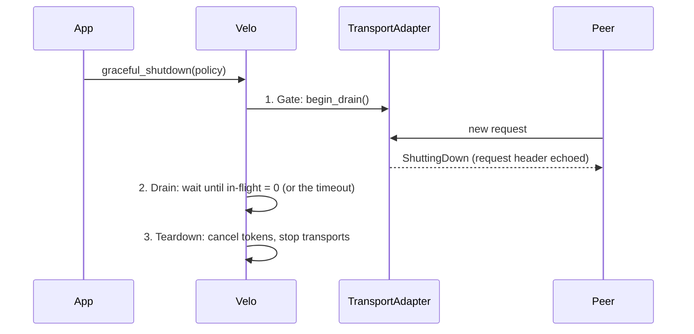

# Shutdown and drain

`Velo::graceful_shutdown(policy)` stops an instance in three phases. With `ShutdownPolicy::WaitForever`, it does not lose a request that it already accepted. With `ShutdownPolicy::Timeout(d)`, teardown drops any accepted request that is still queued when `d` expires.

1. **Gate.** The drain flag goes up. New inbound requests are refused. Responses, acks, events, and the messages of open streams continue to flow, so in-flight work can finish.
2. **Drain.** Velo waits until no admitted request is in flight. `ShutdownPolicy::WaitForever` waits with no limit. `ShutdownPolicy::Timeout(d)` waits up to `d` for the whole call.
3. **Teardown.** Velo cancels the tokens and stops the transports.

`Velo` is `Clone`. If two clones call `graceful_shutdown` at the same time, the first runs the sequence and the second waits for it.

Work that was accepted before the drain keeps flowing through it. The messenger mux sends its records and its credit as active messages, so the gate lets through the handlers that serve accepted work:

- `_stream_batch`, which carries the records and credit of open mux streams.
- `_stream_cancel`, the detach, finalize and cancel handlers of SPSC anchors, and the detach and cancel handlers of MPSC anchors.
- The rendezvous handlers that pull a staged payload and end its lease (`_rv_acquire`, `_rv_pull`, `_rv_detach`, `_rv_release`, `_rv_lease_renew`). A record or response too large for one message is staged, and the receiver pulls it with these handlers. A draining owner answers the pull chunked, never by RDMA. `_rv_metadata` and `_rv_ref` start a new consumer, so the gate refuses them. A handle that an application staged itself can still be pulled with `get` during the drain.
- `_event_trigger`, which completes an awaiter of work that this node already accepted.

Each of these handlers is registered as exempt where it is registered, so the list cannot drift from the code. An attach opens a new stream, so the gate refuses it. A detached SPSC anchor therefore waits out its unattached timeout during a drain, because no new sender can attach. A zero-RTT stream whose pre-bind was made before the drain is not an attach, so its first record can open the slot during the drain.

The drain counts an exempt message while its handler runs. It does not count the stream that the message serves. This has two results:

- A producer that sends without a pause keeps a `ShutdownPolicy::WaitForever` drain waiting until it stops.
- A stream with a quiet gap lets the drain finish. Teardown then ends the mux streams, because they ride the messenger.

To let open streams finish, call `begin_drain`, wait until your streams end, and then call `graceful_shutdown`. The per-stream transports have their own teardown, which `graceful_shutdown` does not do.

## A refused request fails fast

A transport that has a return path answers a refused request with a `MessageType::ShuttingDown` frame. The frame echoes the header of the rejected request, so the sender can find the waiting caller and fail it at once. Without the echo, the caller waits for its own timeout. The echo uses the request header, not a response header, so `ShuttingDown` frames have their own inbound lane.

gRPC has no return path on its client-side read half. There, the transport records the rejection and drops the frame.

## Admission owns the in-flight count

The rule is: **a message on the inbound queue is counted work.** `TransportAdapter::admit_message` is the only way onto the inbound queue. It takes the in-flight guard first, and then it reads the drain flag. The queued message carries the guard, and the guard is not optional.

Two faults made this the rule:

- The consumer took the guard after it dequeued the message. A message in the queue was then invisible to the drain. The fast path of `graceful_shutdown` does not yield, so it could finish inside the gap between enqueue and dequeue. The handler then ran after the instance had declared itself stopped.
- A transport that checked `is_draining()` before it enqueued had a check-then-act race. A request could pass the check, the drain could start and finish, and then the request was enqueued.

`is_draining()` is for reports only. Never use it to decide admission.

The admission check is a store-buffer pattern. The producer increments `in_flight` and then loads the flag. Shutdown stores the flag and then loads `in_flight`. All four accesses must be `SeqCst`. With Acquire and Release, both sides can miss the store of the other side.

A consumer that stops with messages still in its queue must drain the queue and drop the messages. `flume` keeps the buffer alive while any sender clone is alive. Guards left in the buffer hold `in_flight` above zero, and every later drain waits forever.

These tests pin the contract:

| Behavior | Test |
|---|---|
| A queued message holds the drain open | `queued_message_holds_drain` (`velo-ext`) |
| Admission refuses during drain and returns the frame | `admit_message_rejects_during_drain` |
| The drain waiter does not lose a wakeup when a guard drops at the check | `wait_for_drain_survives_guard_dropped_at_the_check` |
| The `ShuttingDown` echo reaches the sender over TCP and UDS | `transport_shutdown_tests!` in `lib/velo/tests/transports/common/mod.rs` |
| The echo completes the waiting caller | `drain_rejection_echo_completes_awaiter` |

## RDMA registrations go first

When the RDMA registration layer is installed, shutdown has four steps:

1. The gate closes. No new request can start. The pull of a payload staged before the drain still passes the gate, but a draining owner answers it chunked, never by RDMA.
2. The registry sweep runs. New registrations are refused, in-flight transfers drain, and each region and arena is unmapped. Anything staged in registered memory first moves to the heap, so an admitted chunked transfer can finish.
3. The messenger gate, drain, and teardown run as usual.
4. Each registration that survived step 2 is declared released, but only if the backend reports that nothing is still registered.

The order of steps 1 and 2 matters. An RDMA GET is issued by the NIC of the peer, so it never shows in the in-flight count of this instance. If the transport stopped first, Velo would unmap memory that a peer is still reading.

Step 4 makes `RegionGuard::deregistered` safe to wait on. After an abnormal teardown, such as a progress thread that panicked, step 4 declares nothing. That memory leaks on purpose, because Velo does not tell a caller to free pages that it cannot prove are released.

Under `ShutdownPolicy::Timeout`, the sweep and the messenger drain share one deadline. Under `WaitForever`, the sweep still uses `RdmaConfig::shutdown_timeout`, so a peer that crashed during a transfer cannot stop shutdown forever. See [Rendezvous and RDMA](rendezvous.md).
