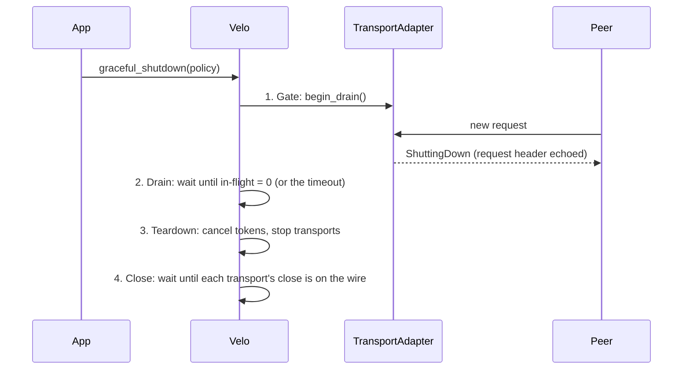

# Shutdown and drain

`Velo::graceful_shutdown(policy)` stops an instance in four phases. With `ShutdownPolicy::WaitForever`, it does not lose a request that it already accepted. With `ShutdownPolicy::Timeout(d)`, teardown drops any accepted request that is still queued when `d` expires.

```mermaid
sequenceDiagram
    participant App
    participant Velo
    participant Adapter as TransportAdapter
    participant Peer
    App->>Velo: graceful_shutdown(policy)
    Velo->>Adapter: 1. Gate: begin_drain()
    Peer->>Adapter: new request
    Adapter-->>Peer: ShuttingDown (request header echoed)
    Velo->>Velo: 2. Drain: wait until in-flight = 0 (or the timeout)
    Velo->>Velo: 3. Teardown: cancel tokens, stop transports
    Velo->>Velo: 4. Close: wait until each transport's close is on the wire
```

1. **Gate.** The drain flag goes up. New inbound requests are refused. Responses, acks, events, and the messages of open streams continue to flow, so in-flight work can finish.
2. **Drain.** Velo waits until no admitted request is in flight. `ShutdownPolicy::WaitForever` waits with no limit. `ShutdownPolicy::Timeout(d)` bounds the drain at `d`. The close step adds the close bound of each transport to that, so the whole call takes at most `d` plus that bound (QUIC: 2.5 seconds).
3. **Teardown.** Velo cancels the tokens and stops the transports. Each transport's shutdown hook runs once, on a dedicated thread, and the call waits for all of them. (A hook runs on the caller instead if the thread cannot be created, and on the building task if the build fails or is cancelled while transports start.) If a hook panics, the other hooks still run, and the call then panics: it cannot report the instance, or its RDMA memory, as released.
4. **Close.** Velo waits for `Transport::closed()` on each transport. TCP and UDS return at once, because the kernel delivers what they wrote after the process exits. QUIC keeps written data in user space until the peer acknowledges it, so it waits up to 2 seconds for its writers to finish their streams and its connections to close. Then it closes the rest by force and waits up to 0.5 seconds more, so that each frame a writer still held is reported as failed. A frame that quinn accepted but the peer did not acknowledge is lost, as a frame in the kernel send buffer is lost when a TCP peer stops reading. The writer logs a warning when that can happen. The exception is an application close from the peer: a peer that closes has gone, as a TCP peer that closes has, so that end is not a warning. A process can exit when `graceful_shutdown` returns.

`Velo` is `Clone`. If two clones call `graceful_shutdown` at the same time, the first runs the sequence and the second waits for it.

Work that was accepted before the drain keeps flowing through it. The messenger mux sends its records and its credit as active messages, so the gate lets through the handlers that serve accepted work:

- The mux batch handlers (`_stream_batch`, and `_stream_batch.1` to `_stream_batch.15`, one for each lane), which carry the records and credit of open mux streams.
- `_stream_cancel`, the detach, finalize and cancel handlers of SPSC anchors, and the detach and cancel handlers of MPSC anchors.
- The rendezvous handlers that pull a staged payload and end its lease (`_rv_acquire`, `_rv_pull`, `_rv_detach`, `_rv_release`, `_rv_lease_renew`). A record or response too large for one message is staged, and the receiver pulls it with these handlers. A draining owner answers the pull chunked, never by RDMA. `_rv_metadata` and `_rv_ref` start a new consumer, so the gate refuses them. A handle that an application staged itself can still be pulled with `get` during the drain.
- The event handlers `_event_trigger`, `_event_trigger_request` and `_event_subscribe`. `_event_trigger` completes an awaiter of work that this node already accepted. `_event_trigger_request` completes an event that this node already created, and it acknowledges the requester. The requester sends it fire-and-forget, so a refusal would never reach the requester's wait. `_event_subscribe` answers at once for an event that is already complete, or records one subscriber for a pending event. None of the three starts new work.

Each handler declares its exemption in the code where it is registered, so the gate cannot disagree with the code. The list above is kept by hand. An attach opens a new stream, so the gate refuses it. A detached SPSC anchor therefore waits out its unattached timeout during a drain, because no new sender can attach. A zero-RTT stream is not an attach: its first record opens the slot that `prebind_anchor` bound, during the drain as well. `prebind_anchor` does not check the drain, so a node that keeps making pre-binds while it drains keeps accepting streams.

The drain counts an exempt message while its handler runs. It does not count the stream that the message serves. This has two results:

- The drain finishes at the first moment that no message is in flight. A stream message is in flight only for microseconds, and consecutive batches are at least a credit round trip apart. An open stream, busy or quiet, therefore does not hold `graceful_shutdown` open.
- Velo then stops and joins mux sends before transport teardown. Ingress slots stay in place until full shutdown detaches their readers, so orderly shutdown does not report a false sender-drop error. The shutdown timeout bounds the drain; joining mux tasks comes after it and needs the owning Tokio runtime to keep running.

To let open streams finish, call `begin_drain`, wait until your streams end, and then call `shutdown`. The application must wait for its streams: the messenger drain does not count their full lifetime.

## Close an instance while Tokio keeps running

Use `Velo::shutdown(policy)` when an application removes a Velo instance but keeps its Tokio runtime. It first runs `graceful_shutdown`, then cancels live anchors and senders, stops the builder-owned per-stream listener, and joins the messenger receive loops and streaming tasks. Pending remote event waits fail at teardown, and their subscription tasks stop. Local event completion remains available. Custom frame transports remain the caller's responsibility.

If the sender of a stream is on the same instance, shutdown cancels that sender. The `cancellation_token` of the sender fires, and later sends fail. The reader of the stream ends when the application drops or finalizes the sender. Shutdown does not end the reader itself. That needs a check on every read.

Call shutdown explicitly to drain and join. Final Velo drop cancels its streams and stops builder-owned streaming services. It also tells each remote producer that its stream ended, while the transports are still up: an attached producer through `_stream_cancel`, and a zero-RTT producer through its mux slot close. This is best effort. It needs the Tokio runtime to keep running, a stalled peer gets the slot close only if it admits it within 0.5 seconds, and without a retained Messenger the transport can close before the notice is written. A producer that is told nothing waits on its next send. When remote producers must be told, call `Velo::shutdown` and end their streams first. A retained `Arc<Messenger>` keeps active messaging available, but does not keep those streams alive. Final Messenger drop starts transport teardown on an owned thread. Explicit shutdown waits for this cleanup, including native transport joins, before it waits for transport close. Neither Drop path waits for work to finish or reports RDMA memory as released. See [Ownership changes in 0.19](../guides/migrate-dispatch-and-cancellation.md#runtime-ownership).

`graceful_shutdown` keeps its existing behavior: it drains and closes the messenger and RDMA services, but does not close the per-stream TCP or gRPC transport. `shutdown` is the complete instance shutdown operation. Application handlers that exceed a timeout can still be running after it returns.

The public task tracker includes receive loops, ordering lanes, and tasks added by the application. `close()` allows `wait()` to finish when all tracked tasks exit; it does not cancel them. Ensure application tasks and idle ordering lanes can exit before waiting. An ordered handler with `with_idle_lane_ttl(None)` can leave a lane waiting forever while its router remains owned. Internal shutdown joins its own receive loops separately, so an application task cannot extend its timeout.

A handler panic fails its waiting caller in every dispatch mode, provided the program unwinds panics. The error reply remains counted work until the transport accepts it. An ordered lane continues with the next message.

Hard teardown interrupts a blocked TCP or UDS write and fails the frames still held by the writer. The connection is discarded if a write may be partial. A reported write failure does not prove that the peer received no bytes; applications must not treat it as permission to retry a non-idempotent request.

## A refused request fails fast

A transport that has a return path answers a refused request with a `MessageType::ShuttingDown` frame. The frame echoes the header of the rejected request, so the sender can find the waiting caller and fail it at once. Without the echo, the caller waits for its own timeout. The echo uses the request header, not a response header, so `ShuttingDown` frames have their own inbound stream.

gRPC has no return path on its client-side read half. There, the transport records the rejection and drops the frame.

## Admission owns the in-flight count

The rule is: **a message on the inbound queue is counted work.** `TransportAdapter::admit_message` is the only way onto the inbound queue. It takes the in-flight guard first, and then it reads the drain flag. The queued message carries the guard, and the guard is not optional.

This count starts at server admission. It does not include requests still in a client or network queue. To settle a known set of client calls before shutdown, call `begin_drain`, keep the server alive until those calls finish or reach their deadlines, then call `shutdown`.

Each caller must bound its response wait, for example with `tokio::time::timeout`. A peer disconnect does not complete every outstanding response slot. A request admitted before peer failure can therefore wait until its caller's deadline. Dropping its response awaiter releases the slot.

Two faults made this the rule:

- The consumer took the guard after it dequeued the message. A message in the queue was then invisible to the drain. The fast path of `graceful_shutdown` does not yield, so it could finish inside the gap between enqueue and dequeue. The handler then ran after the instance had declared itself stopped.
- A transport that checked `is_draining()` before it enqueued had a check-then-act race. A request could pass the check, the drain could start and finish, and then the request was enqueued.

`is_draining()` is for reports only. Never use it to decide admission.

The admission check is a store-buffer pattern. The producer increments `in_flight` and then loads the flag. Shutdown stores the flag and then loads `in_flight`. All four accesses must be `SeqCst`. With Acquire and Release, both sides can miss the store of the other side.

A consumer that stops with messages still in its queue must drain the queue and drop the messages. `flume` keeps the buffer alive while any sender clone is alive. Guards left in the buffer hold `in_flight` above zero, and every later drain waits forever.

These tests pin the contract:

| Behavior | Test |
|---|---|
| A queued message holds the drain open | `queued_message_holds_drain` (`velo-ext`) |
| Admission refuses during drain and returns the frame | `admit_message_rejects_during_drain` |
| The drain waiter does not lose a wakeup when a guard drops at the check | `wait_for_drain_survives_guard_dropped_at_the_check` |
| The `ShuttingDown` echo reaches the sender over TCP, UDS and QUIC | `transport_shutdown_tests!` in `lib/velo/tests/transports/common/mod.rs` |
| The echo completes the waiting caller | `drain_rejection_echo_completes_awaiter` |

## RDMA registrations go first

When the RDMA registration layer is installed, shutdown has four steps:

1. The gate closes. No new request can start. The pull of a payload staged before the drain still passes the gate, but a draining owner answers it chunked, never by RDMA.
2. The registry sweep runs. New registrations are refused, in-flight transfers drain, and each region and arena is unmapped. Anything staged in registered memory first moves to the heap, so an admitted chunked transfer can finish.
3. The messenger gate, drain, teardown, and close run as usual.
4. Each registration that survived step 2 is declared released, but only if the backend reports that nothing is still registered.

The order of steps 1 and 2 matters. An RDMA GET is issued by the NIC of the peer, so it never shows in the in-flight count of this instance. If the transport stopped first, Velo would unmap memory that a peer is still reading.

Step 4 makes `RegionGuard::deregistered` safe to wait on. After an abnormal teardown, such as a progress thread that panicked, step 4 declares nothing. That memory leaks on purpose, because Velo does not tell a caller to free pages that it cannot prove are released.

Under `ShutdownPolicy::Timeout`, the sweep and the messenger drain share one deadline. Under `WaitForever`, the sweep still uses `RdmaConfig::shutdown_timeout`, so a peer that crashed during a transfer cannot stop shutdown forever. See [Rendezvous and RDMA](rendezvous.md).
