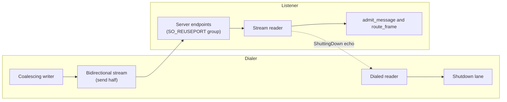

# Transports

A transport moves messenger frames between instances. You add transports when you build the instance. More than one transport can be active at the same time.

```rust,ignore
let node = Velo::builder()
    .add_transport(Arc::new(TcpTransportBuilder::new().build()?))
    .build()
    .await?;
```

## Available transports

| Transport | Feature | Protocol | Notes |
|---|---|---|---|
| TCP | always | Raw TCP | Default. Coalescing writer. |
| UDS | always, Unix only | Unix domain socket | Local only. Coalescing writer. |
| NATS | `nats-transport` (default) | NATS subjects | Subject scheme `velo.{id}.{type}` |
| gRPC | `grpc` (default) | HTTP/2 bidirectional stream | Reconnects with exponential backoff |
| ZMQ | `zmq` | ZMQ DEALER/ROUTER | Reconnects and queues messages |
| UCX | `ucx`, Linux only | UCX active messages over RDMA, TCP, or shared memory | Also carries RDMA rendezvous. See [Rendezvous and RDMA](rendezvous.md). |
| QUIC | `quic` | QUIC over UDP, TLS 1.3 | Pinned self-signed certificate. Coalescing writer. See [QUIC](#quic). |

The `http` feature exists, but the HTTP messenger transport is not built at this time.

## Peer routing

Velo registers each peer with every transport that the peer and the local instance both support. For each peer, Velo selects a primary transport: the compatible transport with the highest priority. Messages to that peer go on the primary transport.

A `WorkerAddress` is a MessagePack map from `TransportKey` to endpoint bytes. Each transport adds its own entry, and a peer reads the entries for the transports that it has.

## The transport contract

Every transport implements the `Transport` trait from `velo-ext`. The runtime relies on these rules:

- **Sends do not wait for the wire.** `send_message` takes the frame and reports when it reached the send channel for the target. Failures after that point go to a `TransportErrorHandler` callback.
- **Inbound frames go to four lanes**: message, response, event, and shutdown. The `TransportAdapter` routes each frame to its lane.
- **Admission owns the in-flight count.** Each inbound `MessageType::Message` goes through `TransportAdapter::admit_message`. See [Shutdown and drain](shutdown.md) for why a transport must not check `is_draining()` itself.
- **Metrics use one handle.** The runtime gives each transport an observability handle through `set_observability`. In-tree and out-of-tree transports write the same `velo_transport_*` series.

## Coalescing writer

TCP, UDS, and QUIC use a coalescing writer. Small frames that wait in the send channel go out together in one write.

A frame above 64 KB (`COALESCE_THRESHOLD`) goes out directly, as two writes. The first write is the preamble and the header, staged in a 256 B stack buffer. The second write is the payload, with no copy. Three writes cost two extra syscalls on a `TCP_NODELAY` socket, and they put small segments on the wire before each large payload. The writer does not use `write_vectored`, because TCP can return a short write for it past about 128 KB.

These costs are for TCP and UDS. On QUIC, quinn copies each write into its own send buffer, so the payload write is not free of copies there, and the three writes cost no extra syscalls.

The reader reserves the full frame length as soon as it has parsed the preamble. Without this, the read buffer grows by doubling from 8 KB, and each step copies all the bytes received so far. On loopback, the two changes together cut the 8 MB round trip from 6.46 ms to 4.70 ms.

The writer publishes `velo_transport_frames_written_total`, `velo_transport_write_duration_seconds`, and `velo_transport_egress_queue_wait_seconds`. gRPC, NATS, ZMQ, and UCX have no such writer and do not publish these series. See [Observability](../operations/observability.md).

## Socket buffers are set before data flows

TCP sets `SO_RCVBUF` and `SO_SNDBUF` on the listening socket, so each accepted socket inherits the sizes at handshake time. The dial side sets them before its first write.

The old code set the sizes on the accepted socket, one task spawn after `accept`. By then the peer was already sending. On Linux, `SO_RCVBUF` at that point turns off receive autotuning and clamps the buffer to `net.core.rmem_max`. The advertised window then collapses for the life of the connection. Throughput fell about 100 times, to 22.9 MB/s, and the fault was racy, so it showed up in some runs only. The `tx_budget` example measures this path and guards against the fault.

## QUIC

The QUIC transport uses [quinn](https://github.com/quinn-rs/quinn). It has the same shape as TCP: one connection for each peer and direction, dialed on the first send.



- **One stream for each connection.** The dialer opens one bidirectional stream and writes velo frames on it with the TCP frame codec. One stream keeps the order of messages from one peer. Ordered handlers and batched streaming rely on that order. Several streams would remove head-of-line blocking after a packet loss, but they would also reorder messages from one peer.
- **Shutdown waits for acknowledgement.** When a writer stops, even at teardown, it finishes its stream and waits up to 1 second for the peer to acknowledge what it wrote, and then closes its connection. A writer that is blocked because the peer stopped reading is closed by force at 2 seconds instead. The dial socket closes when every writer has finished, or at the latest after 2 seconds. A QUIC close discards unacknowledged data, which TCP would still deliver after a close. `Transport::closed()` waits for this, and `graceful_shutdown` waits for `closed()`, so a process can exit when `graceful_shutdown` returns.
- **The reverse direction carries only drain echoes.** The listener writes a `ShuttingDown` frame back on the same stream when it refuses a request during drain. The dialer reads it with the same code as TCP.
- **The certificate is pinned.** Each transport makes a self-signed certificate and puts its SHA-256 fingerprint in its `WorkerAddress` entry. A dialer accepts only that certificate and checks the TLS 1.3 handshake signature. A different listener on a reused port fails the handshake.
- **Server sockets form a reuse-port group** (Linux). `server_endpoints(n)` binds `n` UDP sockets on one port. The kernel hashes each peer to one socket, so the receive queues and buffer ceilings add up. A node that many peers send to, such as a frontend, gains from more sockets. The default is 4. Each socket costs a quinn endpoint and its buffers.
- **The dial socket is separate.** Dials use their own socket on an ephemeral port. A reply to a dial from a group member can hash to another member, which does not know the connection and drops the reply.
- **UDP buffers are checked.** The transport requests 8 MiB receive and 4 MiB send buffers on each socket, reads back what the kernel granted, and logs a warning when `net.core.rmem_max` or `net.core.wmem_max` clamped the request. A clamped UDP buffer shows up later as dropped datagrams, not as an error.
- **Packets are at most 6550 bytes.** quinn sends up to 10 packets in one GSO batch, and a larger packet makes the batch exceed the UDP datagram limit. The batch is then lost with no error. `max_mtu` is lowered to 6550.
- **quinn 0.11.12 is the minimum.** It pulls quinn-proto 0.11.18. Older quinn-proto can fail an ordered, lossless stream of many small chunks with `too many gaps in stream buffer`.

For the tuning settings and the measured cost against TCP, see [QUIC performance](../operations/quic-performance.md).

## Frame transports for streams

Streams without the mux use a `FrameTransport`. TCP is the default. gRPC is available with the `grpc` feature. See [Streaming](streaming.md).

## Add a transport

- For an in-tree transport, follow the procedure in the project `CLAUDE.md` under "Adding a new in-tree transport".
- For a transport in another crate, see [Write an out-of-tree transport](../guides/out-of-tree-transport.md).
