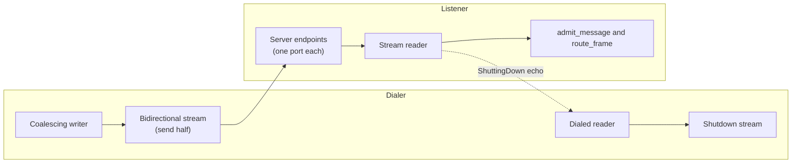

# Transports

A transport moves messenger frames between instances. You add transports when you build the instance. More than one transport can be active at the same time.

```rust,ignore
let node = Velo::builder()
    .add_transport(Arc::new(TcpTransportBuilder::new().build()?))
    .build()
    .await?;
```

## Available transports

| Transport | Feature | Protocol | Notes |
|---|---|---|---|
| TCP | always | Raw TCP | Default. Coalescing writer. |
| UDS | always, Unix only | Unix domain socket | Local only. Coalescing writer. |
| NATS | `nats-transport` (default) | NATS subjects | Subject scheme `velo.{id}.{type}` |
| gRPC | `grpc` (default) | HTTP/2 bidirectional stream | Reconnects with exponential backoff |
| ZMQ | `zmq` | ZMQ DEALER/ROUTER | Reconnects and queues messages |
| UCX | `ucx`, Linux only | UCX active messages over RDMA, TCP, or shared memory | Also carries RDMA rendezvous. See [Rendezvous and RDMA](rendezvous.md). |
| QUIC | `quic` | QUIC over UDP, TLS 1.3 | Pinned self-signed certificate. Coalescing writer. See [QUIC](#quic). |

The `http` feature exists, but the HTTP messenger transport is not built at this time.

## Peer routing

Velo registers each peer with every transport that the peer and the local instance both support. For each peer, Velo selects a primary transport: the compatible transport with the highest priority. Messages to that peer go on the primary transport.

A `WorkerAddress` is a MessagePack map from `TransportKey` to endpoint bytes. Each transport adds its own entry, and a peer reads the entries for the transports that it has.

## The transport contract

Every transport implements the `Transport` trait from `velo-ext`. The runtime relies on these rules:

- **Sends do not wait for the wire.** `send_message` takes the frame and reports when it reached the send channel for the target. Failures after that point go to a `TransportErrorHandler` callback.
- **Order holds per lane.** `lanes(target)` tells how many ordered channels the transport keeps to a peer. The default is 1. `send_message_on_lane` keeps order within one lane only, and `send_message` sends on lane 0. A lane never fails over to another lane's connection, because that would reorder it. The messenger sends its own traffic on lane 0, because ordered handlers need the messages of one peer on one lane. QUIC implements lanes. The other transports keep one lane.
- **Inbound frames go to four streams**: message, response, event, and shutdown. The `TransportAdapter` routes each frame to its stream.
- **Admission owns the in-flight count.** Each inbound `MessageType::Message` goes through `TransportAdapter::admit_message`. See [Shutdown and drain](shutdown.md) for why a transport must not check `is_draining()` itself.
- **Metrics use one handle.** The runtime gives each transport an observability handle through `set_observability`. In-tree and out-of-tree transports write the same `velo_transport_*` series.

## Coalescing writer

TCP, UDS, and QUIC use a coalescing writer. Small frames that wait in the send channel go out together in one write.

A frame above 64 KB (`COALESCE_THRESHOLD`) goes out directly, as two writes. The first write is the preamble and the header, staged in a 256 B stack buffer. The second write is the payload, with no copy. Three writes cost two extra syscalls on a `TCP_NODELAY` socket, and they put small segments on the wire before each large payload. The writer does not use `write_vectored`, because TCP can return a short write for it past about 128 KB.

These costs are for TCP and UDS. On QUIC, quinn copies each write into its own send buffer, so the payload write is not free of copies there, and the three writes cost no extra syscalls.

The reader reserves the full frame length as soon as it has parsed the preamble. Without this, the read buffer grows by doubling from 8 KB, and each step copies all the bytes received so far. On loopback, the two changes together cut the 8 MB round trip from 6.46 ms to 4.70 ms.

The writer publishes `velo_transport_frames_written_total`, `velo_transport_write_duration_seconds`, and `velo_transport_egress_queue_wait_seconds`. gRPC, NATS, ZMQ, and UCX have no such writer and do not publish these series. See [Observability](../operations/observability.md).

## Socket buffers are set before data flows

TCP sets `SO_RCVBUF` and `SO_SNDBUF` on the listening socket, so each accepted socket inherits the sizes at handshake time. The dial side sets them before its first write. The size is 2 MiB by default.

An explicit size turns off the kernel's autotuning, and Linux clamps it to `net.core.rmem_max` and `wmem_max`. With the common value of 212,992, 2 MiB becomes a locked 416 KB buffer, which caps the TCP window near 256 KB. `TcpTransportBuilder::socket_buffers(None)` sets no size, so the kernel autotunes the buffers up to `net.ipv4.tcp_rmem` and `tcp_wmem`. The choice is a trade-off.

The table below was measured on 2026-09-30 with the `throughput` example in its two-host mode, over one connection. The nodes were of the same type as in the [two-node table](../operations/quic-performance.md#two-nodes): Grace aarch64, 200G Ethernet at MTU 1500, `rmem_max` at 212,992. Each process had a whole node and was not pinned. Each cell sent 20,000 messages. Three reps, with the two settings interleaved.

| Traffic | Fixed 2 MiB (MiB/s) | Autotuned (MiB/s) |
|---|---|---|
| 64 KiB, pipelined one way | 2,411–2,506 | 2,618–2,660 |
| 256 KiB, pipelined one way | 2,232–2,355 | 3,359–3,387 |
| 64 KiB, request and reply, 64 in flight | 1,614–1,903 | 1,549–1,612 |
| 256 KiB, request and reply, 64 in flight | 1,892–1,920, p50 8.0 ms | 1,639–1,674, p50 9.6 ms |

The NUMA node that the processes run on also moves these numbers. The two-node table gives 3,920 MiB/s for one TCP connection, 64 KiB pipelined. In a separate run with both processes pinned to the NUMA node of the NIC, that case moved 3,220–3,910 MiB/s with the fixed size and 4,440–4,450 MiB/s with autotuning. Pinned to the other NUMA node, it moved 2,370–2,400 MiB/s with the fixed size.

On loopback, autotuning lost 10% for 64 KiB pipelined, gained 10 to 30% for 256 KiB pipelined, and doubled the p99 for 256 KiB with 64 in flight. Autotuning suits one-way bulk and streaming traffic. The default suits request and reply. The examples that build their transport with `new_transport` (`throughput`, `ping_pong`, `batched_streaming` and `response_plane_bench`) read `VELO_TCP_SOCKET_BUFFERS`: `auto` for autotuning, or a size in bytes.

The old code set the sizes on the accepted socket, one task spawn after `accept`. By then the peer was already sending. On Linux, `SO_RCVBUF` at that point turns off receive autotuning and clamps the buffer to `net.core.rmem_max`. The advertised window then collapses for the life of the connection. Throughput fell about 100 times, to 22.9 MB/s, and the fault was racy, so it showed up in some runs only. The `tx_budget` example measures this path and guards against the fault.

## QUIC

The QUIC transport uses [quinn](https://github.com/quinn-rs/quinn). It has the same shape as TCP: one connection for each peer, lane and direction, dialed on the first send on that lane. With the default of one lane, that is one connection for each peer and direction, like TCP.


```mermaid
graph LR
    subgraph Dialer
        W[Coalescing writer] --> S["Bidirectional stream<br>(send half)"]
        R[Dialed reader] --> A1[Shutdown stream]
    end
    subgraph Listener
        E["Server endpoints<br>(one port each)"] --> F[Stream reader]
        F --> AD[admit_message and route_frame]
        F -. "ShuttingDown echo" .-> R
    end
    S --> E
```

- **One stream for each connection.** The dialer opens one bidirectional stream and writes velo frames on it with the TCP frame codec. One stream keeps the order of the messages on one connection, that is on one lane. Ordered handlers and batched streaming rely on that order. Several streams would remove head-of-line blocking after a packet loss, but they would also reorder the messages of one peer without the caller choosing it. Lanes (below) reorder only across lanes, and the caller picks the lane for each ordered flow.
- **Shutdown waits for acknowledgement.** When a writer stops, even at teardown, it finishes its stream and waits up to 1 second for the peer to acknowledge what it wrote, and then closes its connection. A writer that is blocked because the peer stopped reading is closed by force at 2 seconds instead. The dial sockets close when every writer has finished, or at the latest after 2 seconds. A QUIC close discards unacknowledged data, which TCP would still deliver after a close. `Transport::closed()` waits for this, and `graceful_shutdown` waits for `closed()`, so a process can exit when `graceful_shutdown` returns.
- **The reverse direction carries only drain echoes.** The listener writes a `ShuttingDown` frame back on the same stream when it refuses a request during drain. The dialer reads it with the same code as TCP.
- **The certificate is pinned.** Each transport makes a self-signed certificate and puts its SHA-256 fingerprint in its `WorkerAddress` entry. A dialer accepts only that certificate and checks the TLS 1.3 handshake signature. A different listener on a reused port fails the handshake.
- **Lanes are separate connections.** With `lanes(n)`, the dialer keeps up to `n` connections to each peer, one for each lane that it sends on, each from its own UDP socket. One QUIC connection does its packet and crypto work on one task, so it is bound to about one core. Lanes spread that work over more cores. `send_message` uses lane 0, so ordinary traffic keeps one ordered channel for each peer.
- **Each server socket has its own port.** `server_endpoints(n)` binds `n` UDP sockets, each on its own port, and the `WorkerAddress` entry lists the ports. A dialer sends lane `k` to socket `(offset + k) % n`, where `offset` comes from the dialer's own certificate. So the lanes of one dialer land on different sockets, and the peers are spread over the sockets too. Each socket has its own quinn endpoint driver, receive queue and buffer ceiling. The lanes of a dialer are spread evenly, so a socket can carry two lanes: 8 lanes into 4 sockets moved as much as into 8. The default is 4. Each socket costs a port, a quinn endpoint and its buffers. A peer that does not list ports is dialed on its one advertised port for every lane.
- **Dial sockets are separate.** Dials use their own sockets on ephemeral ports, one for each lane, so each lane has its own endpoint driver for its replies.
- **UDP buffers are checked.** The transport requests 8 MiB receive and 4 MiB send buffers on each socket, reads back what the kernel granted, and logs a warning when `net.core.rmem_max` or `net.core.wmem_max` clamped the request. A clamped UDP buffer shows up later as dropped datagrams, not as an error.
- **Packets are at most 6550 bytes.** quinn sends up to 10 packets in one GSO batch, and a larger packet makes the batch exceed the UDP datagram limit. The batch is then lost with no error. `max_mtu` is lowered to 6550.
- **quinn 0.11.12 is the minimum.** It pulls quinn-proto 0.11.18. Older quinn-proto can fail an ordered, lossless stream of many small chunks with `too many gaps in stream buffer`.

For the tuning settings and the measured cost against TCP, see [QUIC performance](../operations/quic-performance.md).

## Frame transports for streams

Streams without the mux use a `FrameTransport`. TCP is the default. gRPC is available with the `grpc` feature. See [Streaming](streaming.md).

## Add a transport

- For an in-tree transport, follow the procedure in the project `CLAUDE.md` under "Adding a new in-tree transport".
- For a transport in another crate, see [Write an out-of-tree transport](../guides/out-of-tree-transport.md).
