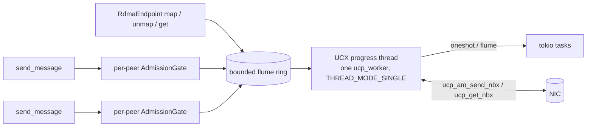

# RDMA design

This chapter records why the RDMA stack has its current shape. It covers the decision for UCX, the rejected alternatives, the invariants that the code depends on, and the faults found on the way. For how the path works, see [Rendezvous and RDMA](../concepts/rendezvous.md). For numbers, see [RDMA performance](../operations/rdma-performance.md).

## The decision: vendored UCX, not raw ibverbs

Velo reaches RDMA through UCX, built from a vendored release tarball and linked statically by the `ucx-rs` crate. A pure-ibverbs messaging transport was designed in full and kept as the fallback (see [The raw ibverbs design](#the-raw-ibverbs-design)).

Round one of the research favored raw ibverbs. Two facts changed the result:

- **The requirement grew.** Rendezvous needed an RDMA GET path. The messenger stages every payload above 256 KiB through rendezvous, so one RMA substrate serves both subsystems.
- **The UCX unknowns resolved in its favor.** The vendored static build worked as a prototype. Two UCX copies in one process measured safe. The wrapper that velo owns priced out smaller than the like-for-like ibverbs scope.

| Axis | Raw ibverbs | Vendored UCX |
|---|---|---|
| New code, with tests | about 6,000 to 8,500 lines (messaging 4,000 to 6,000, plus RMA 1,800 to 2,700) | about 4,900 lines (plus or minus 30%) |
| What velo owns | The wire protocol: credits, SRQ sizing, RNR and timeout tuning, the QP state machine, a bootstrap listener, multi-NIC, GID, and pkey selection, restart races | A safe FFI wrapper: callback soundness, thread affinity, the vendored C build, protocol observability |
| CI with no RDMA hardware | SoftRoCE (`rxe`) on self-hosted runners, fidelity unproven | `UCX_TLS=tcp` on stock runners, the same code path, shown to work |
| Connection setup | TCP bootstrap listener plus a per-connection QP exchange | `ucp_ep_create` from the peer's address blob. No bootstrap subsystem. |
| Performance ceiling | Full control, plain verbs only | `rc_mlx5` accelerated transports with no extra work, no WQE-level control |
| Flow control | Velo-owned credits, observable | UCX-internal, under velo's gate and the mux: three layers, opaque |

The UCX path costs less because the expensive half (worker, op state, admission, health, rendezvous protocol) is common to both paths. What UCX deletes is the wire-protocol half that ibverbs keeps.

### The probe that decided it

UCX can drop RMA lanes under `UCP_ERR_HANDLING_MODE_PEER`, the mode that gives velo peer-death callbacks. Locally, PEER mode made `self`, `posix`, and `sysv` endpoints fail and silently dropped the `rma_bw` lane on `cma`. If RC lost `rma_bw` too, velo had to choose between peer-death detection and zero-copy RMA.

On a live ConnectX-7 InfiniBand host, with UCX 1.22.0 and 1.19.0, RC kept `rma_bw` in PEER mode. The mechanism is in UCX's lane selection. Under PEER mode with rendezvous, it adds `UCT_MD_FLAG_INVALIDATE_RMA` as a requirement. It then removes that requirement again for connect-to-endpoint lanes, because both sides close the connection on error. Every RC transport connects to an endpoint. The lane survived on `rc_mlx5` with DEVX on, with `UCX_IB_MLX5_DEVX=n`, and on `rc_verbs`. A 1 MiB GET completed in 826 µs while the owner never ran its progress loop.

The invalidation requirement still applies to connect-to-interface transports. Shared-memory RMA inside one host under PEER mode therefore falls back to software emulation. For the same reason, the in-process UCX tests run over `tcp`: in PEER mode, the shared-memory lanes are not eligible.

Two more probe facts shaped the wrapper:

- `UCX_TLS=rc_mlx5` alone cannot wire up (`no auxiliary transport ... Destination is unreachable`). A `ud` transport must be in the list. In PEER mode, the `ud` lane does keepalive and wireup only.
- Which exit `ucp_am_send_nbx` takes (see [Completion-owned operations](#completion-owned-operations)) changes between UCX versions. UCX 1.19 completes inline at sizes where 1.22 returns a request.

## Rejected alternatives

Each entry below was tried or studied and failed. They are here so that nobody tries them again without new evidence.

### NIXL for messaging

- `genNotif` gives no ordering guarantee. That alone breaks velo's per-target ordered admission contract.
- The Active Message header is removed (`hdr = nullptr`, and the receiver asserts `header_length == 0`).
- Sends are pinned eager. There is no rendezvous.
- A notification payload is copied about five times. The C shim passes clean spans, but the C++ API takes `const std::string&` and `const std::vector<int>&`, which force the copies. Only an upstream C++ change removes them.
- Delivery is poll-only, under an exclusive lock, with no file descriptor or callback. The default Rust `Agent::new()` spins a progress thread at `poll(fds, n, 0)`, one core at 100%.

Notifications arrived byte-exact up to 8 MiB, so NIXL works. It has the wrong shape for messaging. A claim that NIXL "validates every address" and needs an unsafe bypass was false. `nixlMemSection::populate()` resolves addresses to rkeys, which is necessary work. `prepXferDlist()` amortizes it once per buffer set. One idea was kept: loading a peer's opaque metadata blob creates endpoints eagerly, which matches `address()` and `register(PeerInfo)`.

### A NIXL-based rendezvous prototype

An earlier rendezvous prototype on NIXL had these faults. The current design avoids each one:

- A 64 MiB arena that returned a hard error when full. Now, pool exhaustion falls back to chunked.
- Three slot fields (a mode flag, an optional descriptor, an optional buffer) for one fact. Every combination was representable, and one was meaningful. Now, `SlotBody` is an enum and `StageMode` derives from it.
- Pinned slots refused non-RDMA readers. Now, every pinned slot serves the chunked path.
- `velo_nixl::MemType` on the wire. Now, no backend type crosses the wire. The descriptor carries a backend discriminator and opaque key bytes.
- No lease deadline, so a consumer crash leaked the read lock and the pinned memory.

The two ideas kept from it: the owner decides the path at acquire time, and the two-process launcher became the `rendezvous_rdma_two_proc` example.

### `async-ucx`

The published crate is unmaintained at 0.1.1. Its `Drop` calls `ucp_request_free` without `ucp_request_cancel`, a cancellation soundness hole that was never fixed. Its workers and endpoints are `Rc`-based and `!Send`. Velo's wrapper closes the hole by structure (see [Completion-owned operations](#completion-owned-operations)). From its unmerged modernization branch, three pieces were worth mining: the owned-`Bytes` worker address, the zeroed request-parameter builder, and the bindgen allowlist.

### UCX's own rendezvous for large Active Messages

Letting UCX move large Active Messages with its internal rendezvous speeds up push messaging. It does not help pull-by-handle, it has no story for external memory registration, and it gives descriptor ownership back to user code across shutdown. Velo sets `UCP_AM_SEND_FLAG_EAGER` on every send, caps Active Messages at `eager_max` (1 MiB), and refuses a rendezvous-mode receive. Large payloads go through velo's rendezvous GET.

`UCP_AM_FLAG_PERSISTENT_DATA` does **not** prevent rendezvous receives, although `ucp.h` says so. `ucp_am_rndv_process_rts` sets `FLAG_RNDV` without a condition. An 8 MiB message arrived in rendezvous mode with `PERSISTENT_DATA` set, and in eager mode with the eager flag set.

### UCX API traps

- `ucp_memh_pack` without `UCP_MEMH_PACK_FLAG_EXPORT` calls `ucs_fatal` and aborts the process. The working packer is `ucp_rkey_pack`, marked deprecated, in `ucp_compat.h`. `ucx-rs` binds it and `rkey_pack_canary` asserts it packs.
- `ucp_init` is a static inline in `ucp.h` and does not exist in the archives. Call `ucp_init_version`.
- `ucp_get_nbx` and `ucp_put_nbx` need protocol v2. `UCX_PROTO_ENABLE=n`, a common workaround for protocol-v2 faults, silently disables all RMA.
- A multi-rail GET needs `UCX_MAX_RMA_RAILS` of 2 or more. The default is 1.
- Requesting `UCP_FEATURE_RMA` at `ucp_init` changes Active Message lane selection. Messaging behavior can move when RMA is compiled in.
- A zero-padded copy of a packed rkey does not contain `ucp_ep_rkey_unpack`. Its second parse stage sets `buffer_end = UINTPTR_MAX` and stops only on a `0xFF` byte, so zero padding feeds the walk. Containment must come from a pre-parse of the blob itself.

### Other rejected choices

- **`rdma_cm` for connection setup** (ibverbs design). It needs IPoIB or ibacm for address resolution on native InfiniBand, caps private data at 56 B, and brings its own event state machine. A 50-line exchange over the TCP infrastructure that velo already has is simpler.
- **Inactivity timers on memory registrations.** A timer that evicts a registration while a peer holds its descriptor creates a stale key. UCX rcache, libfabric, MPICH, and NCCL all evict by byte or count ceiling. Timers apply only to empty arenas and to endpoints.
- **`moka` for a future registration cache.** Since 0.12 it has no background threads, so time-to-idle eviction and eviction listeners fire only when something touches the cache. An idle process never evicts. `quick_cache` with a byte weigher and a pinned-while-in-flight lifecycle fits.
- **Per-slot registration by default.** Registering arbitrary caller `Bytes` in place is unsound as a default. The provenance is unknown, UCX pins outward past what the caller owns, and `from_static` and sub-slices exist.
- **`--disable-logging` in the UCX build.** It does not remove logging, it only lowers the maximum level. `UCX_LOG_LEVEL=debug` is the only field diagnostic for a half-initialized link.
- **A consumer-side unpacked-rkey cache, as an optimization.** See [A stale rkey aborts the process on InfiniBand](#a-stale-rkey-aborts-the-process-on-infiniband).

## The UCX transport



- **No listener.** The `WorkerAddress` blob carries the packed `ucp_worker` address (about 200 to 250 bytes, 239 B measured) and the negotiation fields. `register()` stores it. `ucp_ep_create` runs at first use, or at `register()` with `eager_endpoints`. A restarted peer has a new address blob, so most restart races do not exist.
- **One progress thread** owns the `ucp_context` and one worker in `UCS_THREAD_MODE_SINGLE`. UCX is built with `--enable-mt` and `mt_workers_shared=1`. In that build a SINGLE worker takes no lock: the lock macro reduces to a debug-only owner assert. Raw handles never leave the thread's main function. Stock UCX has `--enable-mt` off, and its MULTI mode is one recursive lock around the whole worker.
- **Per-peer admission gates** feed one bounded ring. The single consumer cannot reorder what the gates admitted, so per-target ordering holds. RMA commands bypass the gates, because gate semantics (eager caps, drain rejection, `SendOutcome`) apply to Active Message frames. The bounded ring is the RMA backpressure.
- **Spin, then park.** After the last activity, the loop spins for `spin_us` (20 µs) and then arms the wakeup fd and parks in `poll(2)`. Submitters ring the doorbell only when the loop is parked. A ring push costs about 100 ns and `ucp_worker_signal` costs about 1 to 3 µs. The park has a bounded timeout as a backstop for a lost wakeup.
- **The maximum Active Message header** measured 8101 B. The `Transport` trait cannot express this second cap, so the transport rejects an oversized header before the wire.

### Completion-owned operations

Every posted operation owns its buffers until UCX completes it. One `Arc<OpState>` rides `ucp_request_param_t.user_data`. `ucp_am_send_nbx` has three exits, and exactly one of them drops the `Arc`:

1. `NULL`: completed inline. UCX ignores the callback even if one is set, so the poster drops the `Arc`.
2. A request pointer: the callback fires once, drops the `Arc`, and frees the request.
3. An error pointer: no callback. The poster drops the `Arc` and reports.

Which exit a send takes is not monotonic in size. Over TCP: 64 B returned a request, 64 KiB and 1 MiB returned `NULL`, and 8 MiB returned a request. It also changes between UCX versions. All three exits are always live code. A dropped future only abandons the notification, and `on_error` still fires. Every `extern "C"` trampoline wraps its body in `catch_unwind`.

GETs post with `UCP_OP_ATTR_FLAG_NO_IMM_CMPL`, which removes the inline exit and leaves one completion path.

## RMA invariants

### GET, not PUT

`ucp_get_nbx` completion is final at both ends: the data has landed, and no flush is necessary. `ucp_put_nbx` completion frees only the local buffer. To tell the peer, the sender must first complete a `ucp_ep_flush_nbx`. Active Messages and RMA use different lanes with no ordering between them. Over `UCX_TLS=tcp`, a PUT flush also needs the peer to run its progress loop, which deadlocks shutdown paths. A put that is visible at completion over CMA is an accident of that transport, not a contract.

### One-sidedness depends on the lane

With a native RMA lane, a GET completes with the owner idle (100 MiB in 19.9 ms over CMA, owner never progressed). Without one, UCX silently substitutes `rma_am` software emulation over the Active Message lane. The GET, the flush, and PUT visibility then **hang forever** on an owner that does not progress (measured: 1 s, 5.9 million polls, no completion). CI does not see this, because the owner that answered `_rv_acquire` is progressing. The owner's progress loop therefore stays live for the whole lease, and no separate unprogressed RMA worker exists.

### Single-use rkeys

The packed rkey travels in the descriptor as plain bytes for each transfer. The consumer unpacks it on the progress thread just before the GET and destroys it in the completion callback. `ucp_rkey_h` never leaves the progress thread. No rkey cache and no invalidation protocol exist.

Destroying the rkey in the callback is safe, from the UCX 1.22 source:

- `ucp_rkey_destroy` touches no endpoint. It releases each transport key through its component, a context-level object, and returns the descriptor to the worker's memory pool. What must outlive the rkey is the worker.
- On the close path the endpoint is still alive. A FORCE close takes a discard reference on the endpoint, and the endpoint is freed only after the purge that drives the callbacks with `UCS_ERR_CANCELED`.
- Inside `ucp_worker_destroy`, the purges run before the memory pools are destroyed.

### Progress thread rules

- **No completion callback enqueues onto the ring.** The progress thread is the only consumer of a bounded ring. A callback that blocks on a full ring deadlocks the process. RMA completions resolve a `oneshot` and hand follow-up work to the main loop through a side queue.
- **A parked unmap gates its region.** An unmap of a region with GETs in flight parks its reply. From then on, new GETs on that region are refused. A repeat unmap attaches as another waiter. A caller that cancels and retries therefore never hears that a live, DMA-active region does not exist.
- **Every RMA reply resolves, including at teardown.** `ucp_worker_destroy` does not run user callbacks for operations still outstanding when the bounded drain expires. The worker keeps an `Arc` of every posted operation, and teardown answers each survivor with `ShuttingDown`. The reply sits in a take-once slot, so a late callback cannot answer twice.
- **Offsets are relative to the mapped pointer.** `ucp_mem_map` rounds the pinned range out to page boundaries. A GET destination offset is measured from the caller's pointer and checked against the caller's length. A caller cannot name a byte inside the registration but outside its allocation.
- **A cancelled map rolls back.** The region id is minted before the command is pushed. A dropped `map_region` future pushes an unmap for that id, and the progress thread also rolls back when it finds the reply channel closed.
- **Endpoints close only after the ring is observed empty.** Reply commands carry raw endpoint pointers. The failed-endpoint reaper, the revalidation pass, and the idle reaper all run after the post-progress drain sees an empty ring. An earlier order let a FORCE close free an endpoint that a queued reply still named.

### What teardown cannot promise

Regions unmap before endpoints close for every region idle at teardown, and for every region whose GETs finish during the flush close. A GET posted to a peer that stopped progressing is the exception. The flush close never completes, and the later FORCE close is a no-op: `ucp_ep_close_nbx` returns `UCS_ERR_NOT_CONNECTED` because the flush close already set the closed flag. That GET completes only inside `ucp_worker_destroy`, after the forced unmap. Over TCP this is silent. On InfiniBand the straggler completes with an access error. The caller still gets an answer. The `abandon_rma_ops` path that covers this has no test. The `progress_stall_ms` test seam can now stall a peer's progress thread, which makes such a test possible, but it is not written.

## A stale rkey aborts the process on InfiniBand

Over `UCX_TLS=tcp`, a well-formed but unusable rkey fails inside `ucp_ep_rkey_unpack` and returns an ordinary error. On InfiniBand, the unpack succeeds against a real local memory domain, the GET posts, and `uct_rc_verbs` turns the HCA completion error into `ucs_fatal`:

```text
rc_verbs_impl.h:104  Fatal: receive completion[0] with error on mlx5_2/...: general error, vendor_err 0x0
(signal: 6, SIGABRT: process abort signal)
```

The expected cost of a stale rkey on RC was a dead queue pair and every transfer on it. The measured cost is a dead **process**, with no Rust error to fall back from. A TCP-only CI can never see this class.

Two things keep it out of reach, and the syntactic rkey pre-parse is not one of them:

1. Single-use rkeys: an rkey cannot outlive its operation.
2. Revalidation at every acquire: the owner checks the registration for each transfer.

The pre-parse checks framing. A stale rkey with perfect framing passes it. Consequences:

- The shutdown straggler, the reaper force-release, and shutdown demotion all release memory under a peer that can still hold a descriptor. On InfiniBand that peer's GET can abort the peer's process, not only fail.
- A consumer-side rkey cache removes both safety legs at once. It makes an rkey outlive its operation, and it skips revalidation. Arena reclamation is safe only because an empty arena has no live descriptor, and a cached rkey breaks that too. An rkey cache is a safety change, not a profile-gated optimization.
- The `mlx5` completion path differs from `rc_verbs`. This finding needs a rerun on the accelerated lane.

## The mlx5 link-order defect

### Symptom

On ConnectX-7, `UCX_TLS=rc_mlx5,ud_mlx5` made UCX print:

```text
UCX  WARN  transports 'rc_mlx5','ud_mlx5' are not available, please use one or more of:
ib, mm, posix, rc, rc_v, rc_verbs, self, shm, sm, sysv, tcp, ud, ud_v, ud_verbs
```

UCX then started with `self` only. It did not reach the peer, and every transfer fell back to chunked. The `path_total` metric showed it. Without that metric, the deployment looks like RDMA.

### Evidence that ruled out the hardware

- `configure` recorded `HAVE_MLX5_DV 1`, `HAVE_DEVX 1`, `HAVE_MLX5_HW_UD 1`, and `HAVE_INFINIBAND_MLX5DV_H 1`.
- `libuct_ib_mlx5.a` was built and linked. `uct_rc_mlx5_iface_tl_ops`, `uct_ud_mlx5_iface_tl_ops`, `uct_dc_mlx5_iface_tl_ops`, and `uct_mlx5_init` were in the binary.
- The system UCX 1.18 on the same node and NIC reported `rc_mlx5`, `ud_mlx5`, and `dc_mlx5`.

### Root cause

`uct_ib_init` and `uct_mlx5_init` are ELF constructors. Both add their memory domains to the head of `uct_ib_ops` with `ucs_list_add_head`, so whichever runs **later** owns the head. `uct_ib_component_md_open` takes the first entry that opens, and `uct_ib_verbs_md_open` opens for any device unless DEVX is forced. It also continues past an entry only on `UCS_ERR_UNSUPPORTED`, so a verbs I/O error stops the open instead of falling through to mlx5.

For `static=` archives, constructor order is `.init_array` order, and that is the order in which `build.rs` emits `cargo:rustc-link-lib=static=...`. The build emitted `uct_ib_mlx5` first. So `uct_mlx5_init` ran first, `uct_ib_init` ran second and put verbs at the head, and every mlx5 NIC opened a plain verbs domain. `rc_mlx5`, `dc_mlx5`, and `ud_mlx5` found zero devices.

A shared UCX cannot hit this. `uct_ib_init` loads the mlx5 module with `UCS_MODULE_FRAMEWORK_LOAD` after verbs has registered.

### The fix

`build.rs` emits `static=uct_ib` before `static=uct_ib_mlx5`. With four mlx5 devices at `UCX_LOG_LEVEL=debug`, `md open by 'uct_ib_verbs_md_ops'` became `md open by 'uct_ib_mlx5_devx_md_ops'`. This held under GNU ld 2.42 and under `mold`, the CI linker. The fix was measured on aarch64 with every port down. It proves which domain opens. It does not prove that `rc_mlx5` carries traffic, and x86_64 is not measured.

`crates/ucx-rs/tests/ctor_order.rs` walks `uct_ib_ops` directly and fails if the verbs domain is at the head. It needs no binutils and no ELF parsing.

On a binary built before the fix, `UCX_IB_MLX5_DEVX=y` is a runtime workaround. It makes the verbs open refuse, so the DEVX domain opens.

### What does not work

- **Repeating the archive** (`uct_ib, uct_ib_mlx5, uct_ib`). `static=` bundles archive members into the rlib, and the final link carries no `-l` for them. A repeated archive collapses to its **last** position and reproduces the fault exactly. This advice is correct for a C linker and wrong for rustc.
- **`+whole-archive` or `+verbatim`.** They change inclusion and name resolution, not member position.
- **"Static archives are never loaded by the module loader."** Disproven. The archive was in the binary and the transports registered. The fault was which domain won the open.
- **"Version skew between the system UCX 1.18 and the vendored 1.22."** Disproven. Swapping the archive order on the same 1.22 archives fixes it.

## Building UCX from source inside cargo

The first recipe for the vendored build was wrong in four ways. Each was measured:

1. **`--with-pic` is required.** Static-only libtool emits non-PIC objects. Linking them into any shared object fails on aarch64 with `relocation R_AARCH64_ADR_PREL_PG_HI21 ... recompile with -fPIC`. Python extension modules are shared objects. A Rust cdylib link against non-PIC archives sometimes succeeded and produced a broken library.
2. **The constructor set must be complete.** In a static link, the linker pulls an archive member only if a symbol references it. Without `ucs_init`, UCX links, loads, and fails `ucp_init` with a bare `UCS_ERR_INVALID_PARAM` and no log output, because logging registers from that constructor. The full set is `ucs_init`, `uct_init`, `ucp_global_init`, `uct_ib_init`, `uct_mlx5_init`, `uct_rdmacm_init`, and optionally `uct_cma_init`. It mirrors the `Libs.private` markers in UCX's own pkg-config files.
3. **`cargo:rustc-link-arg` does not cross a crate boundary.** A downstream cdylib linked with no `-lucp` and failed with `undefined symbol: ucs_status_string`. `-Wl,--undefined=` cannot live in a build script. `ucx-rs` references the constructors from a `#[used]` static in `lib.rs` instead, and emits archives with `cargo:rustc-link-lib=static=`. A crate that never names `ucx_rs` drops it and every native library from the link, so `use ucx_rs as _;` is required in that case.
4. **rustc's `-nodefaultlibs` and one-pass archive resolution** leave two symbols unresolved. On aarch64, `__aarch64_ldclr4_sync` lives only in the static `libgcc.a`. On all targets, `pthread_atfork` lives in `libc_nonshared.a`. `build.rs` appends `static=gcc` (aarch64) and `dylib=c` after the UCX archives.

Other build facts:

- The top-level `make` fails under `--disable-shared`, because it links the tools against shared libraries that do not exist. `build.rs` builds `src/ucm`, `src/ucs`, `src/uct`, and `src/ucp` one at a time.
- The tarball SHA-256 is pinned and enforced before anything runs from it.
- `links = "ucx-rs"`, because `lamellar-ucx-sys` already owns `links = "ucx"` on crates.io. The name `ucx-sys` belongs to an unmaintained crate.
- `ucx-rs` is a publishable leaf crate outside velo's type graph. It exports no types that `velo` or `velo-ext` share, so it cannot cause the duplicate-type semver fault that the two-crate rule prevents. See [Versioning](versioning.md).
- With `UCX_DIR`, the constructor references are compiled out. The transport modules of a shared UCX are plugins, and their init symbols are not in the core libraries.
- Bindings are checked in. `--all-features` turns on the `bindgen` feature, but regeneration also needs `UCX_RS_REGEN_BINDINGS=1`, so CI never rewrites tracked files.

### Symbols and a second UCX in one process

NIXL loads its own `libucp` in Dynamo, so two UCX copies in one process was the top operational risk. It measured safe:

- A Rust cdylib that links static UCX exports zero UCX symbols with no extra flags. rustc emits a version script that makes all UCX symbols (about 3,700) local, and the constructors still run. A second version script from the consumer is a link error: `anonymous version tag cannot be combined with other version tags`.
- Eight of eight coexistence cells passed: a static 1.22 cdylib and a `dlopen`ed system 1.20, both load orders, `RTLD_LOCAL` and `RTLD_GLOBAL`, UCM hooks on and off. Both `ucp_init` calls succeeded, with no cross-binding and no crash.
- With `UCX_MEM_EVENTS=n` and `UCX_RCACHE_ENABLE=n`, UCX patches zero libc functions. This was verified by comparing libc entry-point bytes, not by reading logs. Velo sets both by default.
- The claim "hooks off means a clean `dlclose` unload" did not hold. UCM pins itself with `RTLD_NODELETE` in a `--with-pic` build. Velo never unloads UCX, so this does not matter to velo.

## The raw ibverbs design

This design is the fallback if UCX hits a wall that velo cannot work around. It is also the reference for what UCX must beat. Only its core is recorded here.

**Shape.** An in-tree `ibverbs` transport on the `jonhoo/rust-ibverbs` binding (MIT or Apache-2.0, maintained, with extended-verbs batching and completion-channel file descriptors). RC queue pairs, one shared receive queue (SRQ) per device context, and per-peer credits. Eager messages only. No `velo-ext` change.

**Connection setup.** The `WorkerAddress` blob carries a small TCP bootstrap endpoint, device hints, and an incarnation number. `register()` stores the peer and connects nothing. The first send dials the bootstrap listener and exchanges `{qpn, psn, gid, gid_index, mtu, credit window, eager ceiling, incarnation}` once in each direction. A static address blob cannot carry RC state, because the QPN exists only after `ibv_create_qp` for each connection. NCCL and UCX also publish a listener and exchange this data per connection.

**Wire.** One RC SEND per message. The scatter list is an 8-byte fixed header (version, message type, flags, credits granted, header length), then the user header, then the payload. Messages up to about 828 B post inline, so the buffer is free on return. Medium messages copy into a registered slab. RC carries up to 1 GiB in one message on CX-7, so no fragmentation exists.

**Flow control.** A credit is one SRQ slab that the peer can consume. The window is 64 by default. Credits return in the header byte, or in a pure-grant message when the receiver is idle. With credits, RNR cannot occur in steady state.

**Completions.** One completion queue per worker, its completion channel in `tokio::io::unix::AsyncFd`. Arm first with `ibv_req_notify_cq`, then drain, then wait. This order closes the arm race.

**RMA additions.** A second RC queue pair per peer for bulk reads. RC processes work requests in order, so bulk reads on a shared queue pair block Active Messages. Also, one remote access error takes the whole queue pair to ERROR. The bootstrap struct must reserve the second QPN from the start, because a later addition breaks the wire format. `max_rd_atomic` must be set: the binding defaults it to 1, which serializes reads, and CX-7 allows 16. Estimated 1,800 to 2,700 extra lines.

### Seven constraints from the research

1. **Never poll payload memory for arrival.** Last-byte polling breaks InfiniBand spec rule o9-20, relaxed ordering, adaptive routing, and out-of-order placement. Arrival signals are SEND and RECV completions, or `RDMA_WRITE_WITH_IMM`.
2. **RNR is not backpressure.** `min_rnr_timer = 0` encodes 655.36 ms, and `rnr_retry = 7` retries forever. A stalled receiver wedges the sender with no error. Credits make RNR rare. `min_rnr_timer` of 1 to 6 (10 to 80 µs) makes the rare race cheap.
3. **Verbs completions are not a liveness signal.** CX-5 and later firmware enforce a minimum ack timeout of 16 (about 268 ms per try). With `retry_cnt = 7`, a dead peer shows after 3 to 4 s. Health checks must be application-level.
4. **A static address blob cannot carry RC connection state** (see above).
5. **SRQ size is fixed at creation on CX-7.** `SRQ_RESIZE` is absent. `max_srq_wr` is 32,767. The limit event works.
6. **The inline limit on CX-7** is 64·k − 4 bytes: at most 828 B for RC and 956 B for UD. Requests of 912 B or more fail with `EINVAL`. Inline cut latency 35% at 64 B (2.95 to 1.92 µs) and did nothing at 512 B.
7. **Platform tuning is part of the transport.** On aarch64 with default idle states, event-mode p50 at low rates rose from about 10 µs to 88 to 97 µs. A completion IRQ on a busy core put p99.9 at 726 to 1082 µs, against 11 to 15 µs with the IRQ isolated.

### Measurements behind it

Measured on 2026-08-20. "Spark" is an aarch64 DGX-Spark-class host with four ConnectX-7 RoCE ports, all link-down, rdma-core 50, Linux 6.14: verbs objects are real, but no wire traffic occurred. "B200" is an x86_64 DGX B200 node, ConnectX-7 InfiniBand, MLNX OFED 25.07, over a two-HCA path inside the node (`mlx5_0:1` to `mlx5_2:1`, MTU 512). The B200 path hit an unexplained ceiling near 11.6 Gb/s, so rows of 8 KiB and more are lower bounds.

Completion delivery on Spark, 100,000 messages per second, idle states limited and the IRQ isolated:

| Strategy | p50 | p99 | Cores |
|---|---|---|---|
| Busy poll | 2.06 µs | 2.64 µs | 1.000 |
| Raw `epoll` | 8.02 µs | 8.96 µs | 0.409 |
| tokio `AsyncFd` | 8.16 µs | 9.10 µs | 0.463 |
| Spin 5 µs, then park | 7.07 µs | 9.07 µs | 0.672 |

tokio adds 0.14 µs over raw `epoll`. The interrupt path is the cost. A shared busy-poll core delivers about 5.4 µs to workers, not 2 µs, because the dispatch hop adds 3.34 µs.

`ib_send_lat`, RC one-way, B200, depth 1:

| Size | No inline | Inline (828 B cap) |
|---|---|---|
| 64 B | 2.95 µs | 1.92 µs |
| 512 B | 3.61 µs | 3.62 µs |
| 1 KiB | 3.95 µs | not applicable |
| 8 KiB | 9.99 µs | not applicable |
| 64 KiB | 52.5 µs | not applicable |
| 1 MiB | 785 µs | not applicable |

Registration against `memcpy`, B200, median of 101, memory touched first:

| Size | Register, 4 KiB pages | Register, 2 MiB THP | Deregister, THP | `memcpy` |
|---|---|---|---|---|
| 4 KiB | 13.7 µs | 13.7 µs | 12.4 µs | 0.05 µs |
| 256 KiB | 18.7 µs | 14.5 µs | 12.4 µs | 4.6 µs |
| 1 MiB | 36.3 µs | 18.7 µs | 12.5 µs | 27.5 to 35.8 µs |
| 8 MiB | 250.9 µs | 36.5 µs | 12.9 µs | 486 to 494 µs |

Copying into a pre-registered pool beats register-then-transfer below about 0.5 MiB for a cold source and about 2 MiB for a cache-resident source. The `memcpy` cache cliff (76 to 17 GB/s) sets that crossover, not the registration cost. With 4 KiB pages, deregistration grows to 561 µs at 64 MiB, so pools use huge pages. UCX's cost model (16 µs plus 0.06 ns per byte) is about 2x pessimistic on this hardware.

Other measured facts: one queue pair costs 8.2 KB of host memory at depth 4 or less, and 16.2 KB at depth 16 (12.2 KB with an SRQ). Implicit on-demand paging (one key for the whole address space) works on CX-7 with an 11 ms one-time cost. It is a capability probe only, never the default.

Operational traps found during the probes: `perftest -I` prints the requested inline size, not the granted one. A single-host UCX benchmark silently selects shared memory and reports impossible numbers. A partial pkey membership breaks UCX while raw verbs works.

## TCP faults found on the way

The baseline work for this design measured velo's existing transports and found two TCP faults. Both are fixed. A harness, `examples/examples/tx_budget.rs`, adds one layer per rung and attributes the cost of each. It found the faults and now guards against them. It asserts nothing, so a regression shows only when someone runs it.

### Socket buffers sized after data was in flight

**Symptom.** At 16 KiB and more with 64 messages in flight, TCP throughput collapsed by 100 to 350 times. At 256 KiB x 64, TCP moved 22.9 MB/s against 2,648 MB/s for the same code over UDS. The p50 round trip was 1.45 s.

**Mechanism.** Velo's messenger connections are one-directional. The dialing peer writes as soon as `connect()` returns. The accepting side set `SO_RCVBUF` and `SO_SNDBUF` one task spawn later, after the first burst was in flight. On Linux, setting `SO_RCVBUF` then locks the buffer, turns off receive autotuning, and clamps it to `net.core.rmem_max`. With the common `rmem_max` of 212,992, the 2 MiB request becomes about 416 KiB. By then the window has already grown past that size, and the kernel collapses the advertised window for the life of the connection. `ss` showed `snd_wnd:32640` with `rwnd_limited:100.0%`. The fault was per connection and racy, so results were bimodal across runs.

**Correction to the first analysis.** The first analysis applied the same options to an idle socket, saw an 18% cost, and called the buffer hypothesis refuted. That test removed the race, and the race is the mechanism.

**Fix.** The listening socket sets the buffer sizes, and accepted sockets inherit them at handshake time. The dialing side still sets its own before the first write, which cannot race. The streaming TCP transport had the same fault and the same fix. On aarch64 loopback, 256 KiB x 64 went from 8.8 to 27.9 MB/s (8 of 8 runs collapsed) to 2,470 to 4,173 MB/s (8 of 8 healthy). Inherited sizes are also faster than no sizes at all, because autotuning starts cold.

### Three writes per large frame

Above the 64 KiB coalesce threshold, the direct write path called `write_all` three times per frame (an 11 B preamble, the header, the payload) on a `TCP_NODELAY` socket. This added 10.2 µs one-way at 256 KiB. The preamble and header now go into a 256 B stack buffer and leave in one write, so a frame takes two writes. `writev` was rejected, because TCP `write_vectored()` can short-write past about 128 KiB. The decoder also reserves the whole announced frame after it parses the preamble. Before, `Framed` doubled its buffer from 8 KiB and copied everything received at each step. With both changes, the codec rung at 8 MiB went from 3.73 ms to 2.94 ms, and `strace -c` over 1,100 frames showed `sendto` fall from 6,644 to 4,476.

### Where the per-message time goes

On aarch64 loopback, 64 B header plus 1 KB payload, depth 1, a four-worker tokio runtime on performance cores:

| Rung | Layers | One-way p50 |
|---|---|---|
| L0 | Blocking socket calls, OS threads | 5,996 ns |
| L1 | Plus tokio | 5,652 ns |
| L2 | Plus `TcpFrameCodec` | 5,668 ns |
| L3 | Full `Transport` and `DataStreams` | 11,368 to 11,599 ns |

The codec adds 16 ns, and `AdmissionGate::send` adds 16 ns over a raw `flume::try_send`. Of the 5,700 ns the full transport adds, 84% is two cross-thread wakes of a parked task (2,393 ns each, against 216 ns on a pinned `current_thread` runtime). About 3.7 µs of that is removable with no RDMA, by removing cross-core wakes. UDS at L3 is 5,235 ns. So inside one node, an RDMA messaging transport gains little over UDS. Between nodes, it gains 4 to 11 times: about 2 µs of wire plus 2.9 µs of software, against 15 to 50 µs of TCP wire plus 5.7 µs.

## Open questions

- **Three layers of flow control.** The mux budgets, the admission gate, and UCX's internal window and arbiter all sit on one path. UCX's layer is not observable. Nobody has analyzed whether they deadlock or double-buffer. This is the largest open design question on the chosen path.
- **Fabric prerequisites.** RoCEv2 without PFC or ECN degrades under congestion through go-back-N. Kubernetes memlock budgets, device plugins, and the GID index inside a network namespace are not researched.
- **Zero-copy receive.** It depends on an audit that no downstream path turns inbound `Bytes` into `BytesMut`, which copies owner-backed bytes.
- **libfabric, UCCL, and Mooncake** were not scored.
- **The accelerated lane.** The threshold, the packed rkey size, the stale-rkey abort, and the `abandon_rma_ops` path all need a run on `rc_mlx5`.
