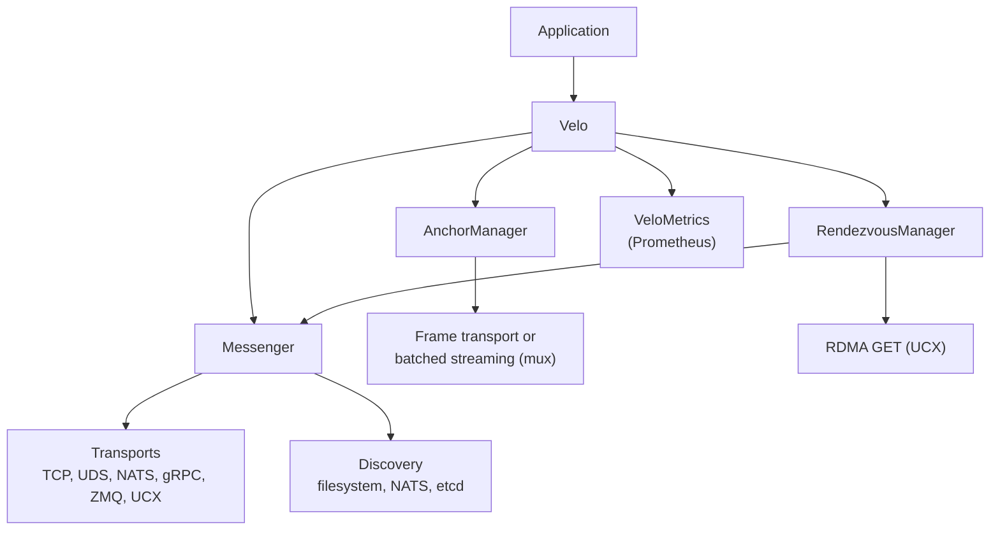

# Velo

Velo is a distributed messaging library for Rust. It gives active messages, typed streams, distributed events, large-payload transfer, and work queues over pluggable transports. It has peer discovery and Prometheus metrics built in.

Velo is experimental. The APIs are not stable yet. Do not use Velo in production.

## What a Velo instance holds

A `Velo` instance wraps three managers behind one API:

- **Messenger**: active messages with four patterns (fire-and-forget, sync, unary, typed unary) and named handlers.
- **AnchorManager**: typed streams. One producer attaches to one anchor and sends items to the consumer that owns the anchor.
- **RendezvousManager**: large payloads. The owner stages the bytes, and a peer pulls them by handle. Over UCX, the pull is a one-sided RDMA read.

You inject transports, discovery, and metrics when you build the instance.

## Two crates

| Crate | For | Contents |
|---|---|---|
| `velo` | Application authors | The runtime: messaging, streaming, rendezvous, events, queues, discovery, all in-tree transports, metrics |
| `velo-ext` | Authors of out-of-tree plugins | The stable trait surface: `Transport`, `FrameTransport`, `PeerDiscovery`, `ServiceDiscovery`, `TransportObservability`, and the value types these traits use |

Application authors depend on `velo` only. See [Workspace crates](development/architecture.md) for why there are only two crates.

## How to read this book

- **Concepts** explains each subsystem and the contract that it keeps.
- **Guides** gives procedures for common tasks.
- **Operations** covers metrics, saturation, benchmarks, and the measured performance.
- **Development** records the workspace rules and the design decisions, with the reasons and the alternatives that were rejected.
