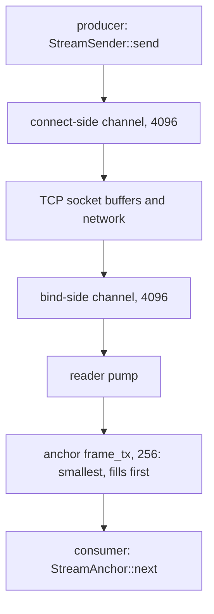
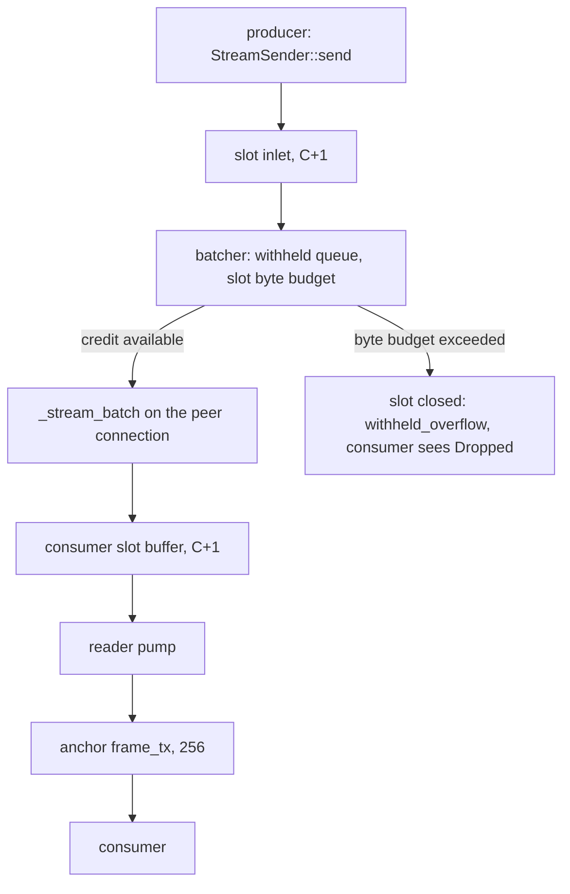

# Stream saturation

If streaming traffic shows sender errors, missed deadlines, or a `Dropped` frame with no producer crash, use this runbook. The usual cause is saturation. The producer generates frames faster than the consumer drains them. Velo reports saturation through Prometheus counters and one log line. This page tells you which signals to read and what to do.

The signals differ between the per-stream path and the messenger mux. Read [The per-stream cascade](#the-per-stream-cascade) for streams with one TCP or gRPC connection each. Read [Saturation under the mux](#saturation-under-the-mux) for streams that negotiated `messenger-mux-v1`.

## The per-stream cascade

A per-stream stream uses a chain of bounded `flume` channels around a TCP or gRPC byte stream:



When the consumer falls behind, the 256-deep anchor channel fills first. Pressure then moves back up the chain:

1. The anchor channel (256) fills.
2. The reader pump's `try_send` returns `Full`. `velo_streaming_reader_pump_backpressure_total` increments.
3. The bind-side channel (4,096) fills.
4. The server pump's `try_send` returns `Full`. `velo_streaming_server_pump_backpressure_total` increments.
5. The TCP receive buffer fills, and the kernel sends a zero-window ACK.
6. The producer's TCP write stalls.
7. The connect-side channel (4,096) fills.
8. `StreamSender::send` sees `Full`. `velo_streaming_producer_send_backpressure_total` increments, and the producer waits in `send_async`.
9. The sender's heartbeats use `try_send`, so a full channel drops them. After `DETECTION_MULTIPLIER × heartbeat_interval` of silence (3 × 5 s by default), the reader pump's watchdog fires. `velo_streaming_heartbeat_watchdog_firings_total` increments, and the session ends.

The consumer sees one of two results when the watchdog fires:

- **The anchor channel had room.** This is the common case, usually a producer that died. The consumer receives a `Dropped` frame, which `StreamAnchor::next()` returns as `StreamError::SenderDropped`.
- **The anchor channel was full.** The watchdog uses a non-blocking `try_send`, so that registry and cancel cleanup cannot deadlock. The `Dropped` frame is lost. The consumer drains the queued frames and then receives `None` (a clean end of stream). A `tracing::warn!` line with the `local_id` records the loss.

In both cases `velo_streaming_heartbeat_watchdog_firings_total` is the authoritative signal. Do not detect watchdog kills from `StreamError::SenderDropped` alone.

### Counters

All four counters have no labels. They register in the Prometheus registry that you pass to `Velo::builder().metrics(...)`.

| Metric | Meaning | How to read it |
|---|---|---|
| `velo_streaming_reader_pump_backpressure_total` | The 256-deep anchor channel was full, and the reader pump fell through to an awaited send. | Leading indicator. A sustained non-zero rate means that the consumer is at or near saturation. |
| `velo_streaming_server_pump_backpressure_total` | The 4,096-deep bind-side channel was full. | The cascade moved past the anchor channel. With reader-pump backpressure, this shows saturation. |
| `velo_streaming_producer_send_backpressure_total` | `StreamSender::send` found its channel full. | The producer now waits in `send_async`. |
| `velo_streaming_heartbeat_watchdog_firings_total` | A session was silent for `DETECTION_MULTIPLIER × heartbeat_interval`, and the reader pump ended it. | Lagging indicator. Any increase means that a session died. |

A backpressure counter measures events, not latency, throughput or bytes. A high rate means that the system is at its capacity. A zero rate means that there is headroom.

### Dashboard

Build at least three panels:

1. `rate(velo_streaming_reader_pump_backpressure_total[1m])`. A rising rate is the earliest warning.
2. `rate(velo_streaming_server_pump_backpressure_total[1m])` and `rate(velo_streaming_producer_send_backpressure_total[1m])` beside the first panel. When these rise in sequence, the cascade is moving up.
3. `increase(velo_streaming_heartbeat_watchdog_firings_total[5m])`. Any non-zero value is a dead session. If the rate panels rose first, the cause was saturation. If they stayed flat, the producer crashed or the network failed.

### The watchdog log line

When the watchdog fires, the reader pump writes one `warn` line:

```text
reader_pump: heartbeat watchdog fired, injecting Dropped (saturation indicator: see velo_streaming_*_backpressure_total)
  local_id=...
  anchor_frame_tx_len=256 anchor_frame_tx_cap=256
  transport_rx_len=4096 transport_rx_cap=4096
  heartbeat_deadline_ms=5000
  detection_multiplier=3
```

Read the channel depths:

- If `anchor_frame_tx_len` equals `anchor_frame_tx_cap`, the consumer side was saturated.
- If both depths are near zero, the silence came from upstream of the consumer. The cause is a producer crash, a network partition, or a backlog on the producer's egress. On a mux peer link that carries thousands of streams, heartbeats wait in the same queue as data. A deep enough backlog there silences a live sender. In one measured UCX run, 1,722 streams on one congested peer were killed this way while their worker was healthy.

### Mitigations

Apply these in order, from the smallest change to the largest:

1. **Slow the producer.** A `tokio::time::sleep` of 100 µs between sends, or `tokio::task::yield_now().await`, often ends saturation. The producer does not know the consumer's rate. Back off voluntarily, or use the producer-side backpressure counter as feedback.
2. **Speed up the consumer.** Move work out of the `anchor.next().await` loop into a separate task. The anchor consumer must only take each frame and hand it on.
3. **Resize the MPSC anchor channel.** `MpscAnchorConfig::channel_capacity` sets the depth of an MPSC anchor channel (256 by default). A larger channel absorbs bigger bursts at a memory cost per anchor. The SPSC anchor channel is fixed at 256.
4. **Reduce the number of concurrent anchors on the per-stream path.** Each anchor adds channel memory and a reader pump. If your application creates one anchor per work item, batch the work items into one anchor. For many streams to few peers, enable the mux instead. See [Tune batched streaming](../guides/tune-batched-streaming.md).

## Saturation under the mux

A muxed stream has no socket of its own. It has credit. A consumer that stops draining stops returning credit, and the stream's egress parks. The kill is different, and the difference is visible to users.

Parked egress must not park the producer. `finalize`, `detach` and `Drop` reach the slot inlet from synchronous code, and credit can park a slot for as long as the consumer is stopped. The batcher therefore drains every inlet into a per-slot withheld queue. The slot byte budget (1 MiB by default) bounds that queue.



### The per-slot kill

When a producer runs past the byte budget on a slot that nobody drains, the mux closes that slot:

- The producer's channel returns errors at once.
- The consumer receives `Dropped`.
- `velo_streaming_mux_records_dropped_total{reason="withheld_overflow"}` increments.
- The peer's other slots continue.

A queued terminal goes with the slot. A consumer that expected `Finalized` sees `Dropped`. The stream was already 1 MiB behind, so the terminal was late in any case.

This kill replaces the watchdog kill for muxed streams. It is deterministic, it names one slot, and it is metered as a drop, not as a liveness failure. `velo_streaming_heartbeat_watchdog_firings_total` remains the signal for a peer that went silent for another reason.

If the slot is fenced behind an unresolved `OpenSlot` or rendezvous admission, the consumer's `Dropped` waits for that admission. The producer is disconnected at once. If the admission fails, the failure is epoch death for the whole peer. The slot is retired without the deferred `Dropped`, and the consumer falls back on the heartbeat watchdog.

The knob is `MuxConfig::slot_byte_budget`. A larger budget gives a slow consumer more run-ahead before the kill. A smaller budget fails a wedged stream sooner.

### Mux counters

| Metric | Meaning |
|---|---|
| `velo_streaming_slot_credit_exhausted_total` | A slot on the sender ran out of credit. This is the mux equivalent of consumer backpressure. |
| `velo_streaming_mux_withheld_records` | Gauge of records waiting in withheld queues on this node. |
| `velo_streaming_mux_records_dropped_total{reason="withheld_overflow"}` | Records dropped by the per-slot kill. |
| `velo_streaming_producer_send_backpressure_total` | The slot inlet (C+1 deep) was full. Under the mux, the batcher drains inlets whether or not a slot has credit. A full inlet therefore means that the batcher is parked on transport admission, not that the slot ran out of credit. |
| `velo_transport_send_backpressure_total` | The transport's admission gate returned `Pending`. The peer connection is congested. |
| `velo_streaming_mux_reader_stall_total` | Must be zero. A non-zero value is a bug in the credit invariant. |
| `velo_streaming_mux_live_slots` | Gauge of open slots. It must return to zero at teardown. |

`velo_streaming_producer_send_backpressure_total` changes meaning under the mux. On the per-stream path it means that the 4,096-deep connect-side channel was full. Dashboards built on that meaning shift when the mux is enabled. Watch `velo_streaming_slot_credit_exhausted_total` for consumer-driven saturation.

### The async_open_ack exposure

With `MuxConfig::async_open_ack` enabled, a healthy consumer is not necessary for the per-slot kill. The `OpenSlot` fence withholds a slot's records from the first record, with or without credit. A producer that starts generating into a peer whose send queue is congested can fill the byte budget before its own `OpenSlot` is admitted. The slot dies the same way and shows the same metrics, but the cause is sender-side congestion.

This exposure does not compose the way the ordinary kill does. `peer_byte_budget` bounds the receive side only. N concurrent opens into a stalled peer can hold N times the slot byte budget in egress memory. The default awaited open serializes new opens behind the same admission and bounds this to one wait at a time.

No signal separates this kill from the ordinary one. Both report `withheld_overflow`. `velo_streaming_mux_withheld_records` has no label, and the `overflow_kill` log line does not say whether the slot was fenced. If `async_open_ack` is disabled, the fenced cause cannot occur, so the kill is the ordinary one. If it is enabled, the metrics cannot tell the two causes apart. You need other evidence, such as the send queue depth of the peer when the slot died.

A slot killed while fenced stays in `velo_streaming_mux_live_slots`. Its deferred `CloseSlot` must not overtake its `OpenSlot`, so the registry entry survives the kill until the admission resolves. If the admission never resolves, the entry, its index, its withheld bytes and its `live_slots` count stay for the rest of the peer's epoch. `batcher_idle_ttl` evicts only a batcher with zero live slots, so it does not bound this.

## Write coalescing ratio

Two counters describe the write side on the per-stream path:

| Metric | Meaning |
|---|---|
| `velo_streaming_frames_written_total` | Stream frames written to the wire. |
| `velo_streaming_egress_flushes_total` | Batches the egress pump handed to the socket. |

Their ratio is the coalescing ratio. The egress pump packs everything already queued on one stream into one flush. A stream whose producer runs ahead reports hundreds of frames per flush. A stream that emits one frame at a time reports about 1.0.

A flush is a unit of coalescing, not a syscall. `write_all` can loop over several writes. An oversized frame is written in segments and still counts as one flush. The kernel decides the TCP segmentation.

A ratio near 1.0 is not a fault. It means that one frame was queued each time the pump woke. It matters when many anchors stream to the same peer. Coalescing is per stream, so it cannot pack frames spread across streams. That case is what the mux solves. See [Batched streaming](../concepts/batched-streaming.md). Under the mux, read `velo_streaming_mux_records_per_batch{direction="sent"}` instead.
