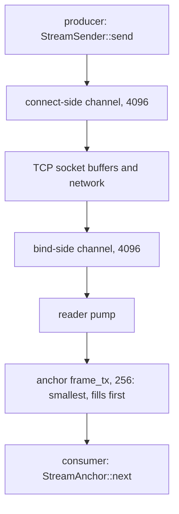
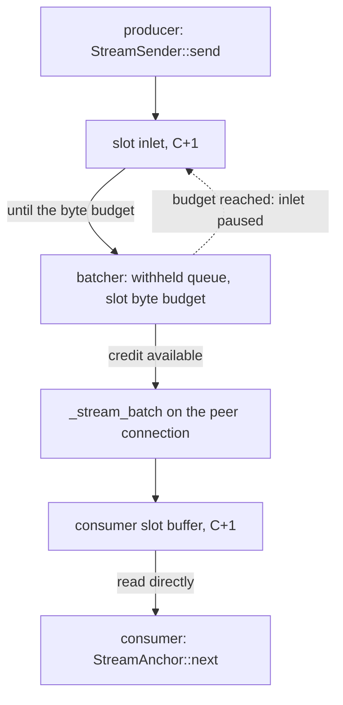

# Stream saturation

If streaming traffic shows sender errors, missed deadlines, or a `Dropped` frame with no producer crash, use this runbook. The usual cause is saturation. The producer generates frames faster than the consumer drains them. Velo reports saturation through Prometheus counters and one log line. This page tells you which signals to read and what to do.

The signals differ between the per-stream path and the messenger mux. Read [The per-stream cascade](#the-per-stream-cascade) for streams with one TCP or gRPC connection each. Read [Saturation under the mux](#saturation-under-the-mux) for streams that negotiated `messenger-mux-v2`.

## The per-stream cascade

A per-stream stream uses a chain of bounded `flume` channels around a TCP or gRPC byte stream:


```mermaid
flowchart TD
    P[producer: StreamSender::send] --> C1[connect-side channel, 4096]
    C1 --> T[TCP socket buffers and network]
    T --> C2[bind-side channel, 4096]
    C2 --> R[reader pump]
    R --> A[anchor frame_tx, 256: smallest, fills first]
    A --> Q[consumer: StreamAnchor::next]
```

When the consumer falls behind, the 256-deep anchor channel fills first. Pressure then moves back up the chain:

1. The anchor channel (256) fills.
2. The reader pump's `try_send` returns `Full`. `velo_streaming_reader_pump_backpressure_total` increments.
3. The bind-side channel (4,096) fills.
4. The server pump's `try_send` returns `Full`. `velo_streaming_server_pump_backpressure_total` increments.
5. The TCP receive buffer fills, and the kernel sends a zero-window ACK.
6. The producer's TCP write stalls.
7. The connect-side channel (4,096) fills.
8. `StreamSender::send` sees `Full`. `velo_streaming_producer_send_backpressure_total` increments, and the producer waits in `send_async`.
9. The sender's heartbeats use `try_send`, so a full channel drops them. After `DETECTION_MULTIPLIER × heartbeat_interval` of silence (3 × 5 s by default), the reader pump's watchdog fires. `velo_streaming_heartbeat_watchdog_firings_total` increments, and the session ends.

The consumer sees one of two results when the watchdog fires:

- **The anchor channel had room.** This is the common case, usually a producer that died. The consumer receives a `Dropped` frame, which `StreamAnchor::next()` returns as `StreamError::SenderDropped`.
- **The anchor channel was full.** The watchdog uses a non-blocking `try_send`, so that registry and cancel cleanup cannot deadlock. The `Dropped` frame is lost. The consumer drains the queued frames and then receives `None` (a clean end of stream). A `tracing::warn!` line with the `local_id` records the loss.

In both cases `velo_streaming_heartbeat_watchdog_firings_total` is the authoritative signal. Do not detect watchdog kills from `StreamError::SenderDropped` alone.

### Counters

All four counters have no labels. They register in the Prometheus registry that you pass to `Velo::builder().metrics(...)`.

| Metric | Meaning | How to read it |
|---|---|---|
| `velo_streaming_reader_pump_backpressure_total` | The 256-deep anchor channel was full, and the reader pump fell through to an awaited send. | Leading indicator. A sustained non-zero rate means that the consumer is at or near saturation. Per-stream path only: a mux stream has no reader pump, so this counter stays at zero there. |
| `velo_streaming_server_pump_backpressure_total` | The 4,096-deep bind-side channel was full. | The cascade moved past the anchor channel. With reader-pump backpressure, this shows saturation. |
| `velo_streaming_producer_send_backpressure_total` | `StreamSender::send` found its channel full. | The producer now waits in `send_async`. |
| `velo_streaming_heartbeat_watchdog_firings_total` | A session was silent for `DETECTION_MULTIPLIER × heartbeat_interval`, and the reader pump ended it. Under the mux, the stream watchdog increments it too. | Lagging indicator. Any increase means that a session died. |

A backpressure counter measures events, not latency, throughput or bytes. A high rate means that the system is at its capacity. A zero rate means that there is headroom.

### Dashboard

Build at least three panels:

1. `rate(velo_streaming_reader_pump_backpressure_total[1m])`. A rising rate is the earliest warning on the per-stream path. For mux streams, use `rate(velo_streaming_slot_credit_exhausted_total[1m])` instead, which the producer's node counts.
2. `rate(velo_streaming_server_pump_backpressure_total[1m])` and `rate(velo_streaming_producer_send_backpressure_total[1m])` beside the first panel. When these rise in sequence, the cascade is moving up.
3. `increase(velo_streaming_heartbeat_watchdog_firings_total[5m])`. Any non-zero value is a dead session. If the rate panels rose first, the cause was saturation. If they stayed flat, the producer crashed or the network failed.

### The watchdog log line

When the watchdog fires on the per-stream path, the reader pump writes one `warn` line:

```text
reader_pump: heartbeat watchdog fired, injecting Dropped (saturation indicator: see velo_streaming_*_backpressure_total)
  local_id=...
  anchor_frame_tx_len=256 anchor_frame_tx_cap=256
  transport_rx_len=4096 transport_rx_cap=4096
  heartbeat_deadline_ms=5000
  detection_multiplier=3
```

Read the channel depths:

- If `anchor_frame_tx_len` equals `anchor_frame_tx_cap`, the consumer side was saturated.
- If both depths are near zero, the silence came from upstream of the consumer. The cause is a producer crash, a network partition, or a backlog on the producer's egress.

On a single-sender mux stream, the stream watchdog writes a different line. An MPSC anchor's reader pump, on any transport, neither logs a firing nor counts it:

```text
stream_watchdog: nothing arrived from a sender holding credit for the detection window, injecting Dropped
  local_id=...
  slot_buffer_len=...
  arrivals=...
  heartbeat_deadline_ms=5000
  detection_multiplier=3
```

This watchdog fires only when nothing was delivered to the slot for the whole detection window while its sender still held data credit or had records waiting behind a sequence gap. Heartbeats spend data credit, so a sender that held credit could have sent one. A consumer that falls behind leaves its sender without credit, and the watchdog exempts such a sender, so a firing on a mux stream is never a consumer that fell behind. Records still in the slot buffer when it fires are not delivered: the consumer reads `SenderDropped` next. The silence came from upstream: a producer crash, a network partition, or a backlog on the producer's egress or the peer link. On a mux peer link that carries thousands of streams, heartbeats wait in the same queue as data. A deep enough backlog there silences a live sender. In one measured UCX run, 1,722 streams on one congested peer were killed this way while their worker was healthy.

### Mitigations

Apply these in order, from the smallest change to the largest:

1. **Slow the producer.** A `tokio::time::sleep` of 100 µs between sends, or `tokio::task::yield_now().await`, often ends saturation. The producer does not know the consumer's rate. Back off voluntarily, or use the producer-side backpressure counter as feedback.
2. **Speed up the consumer.** Move work out of the `anchor.next().await` loop into a separate task. The anchor consumer must only take each frame and hand it on.
3. **Resize the MPSC anchor channel.** `MpscAnchorConfig::channel_capacity` sets the depth of an MPSC anchor channel (256 by default). A larger channel absorbs bigger bursts at a memory cost per anchor. The SPSC anchor channel is fixed at 256.
4. **Reduce the number of concurrent anchors on the per-stream path.** Each anchor adds channel memory and a reader pump. If your application creates one anchor per work item, batch the work items into one anchor. For many streams to few peers, use the mux, which is on by default. See [Tune batched streaming](../guides/tune-batched-streaming.md).

## Saturation under the mux

A muxed stream has no socket of its own. It has credit. A consumer that stops draining stops returning credit, and the stream's egress parks. The producer then waits, as it waited on a full socket buffer.

The batcher pulls each slot's records from the slot inlet into a per-slot withheld queue, whether or not the slot has credit. The slot byte budget (1 MiB by default) bounds that queue. When the queue reaches the budget, the batcher stops pulling from that slot's inlet. The inlet (C+1 records deep) then fills, and `StreamSender::send` waits. When credit returns and the queue drops below the budget, the batcher pulls again.


```mermaid
flowchart TD
    P[producer: StreamSender::send] --> I[slot inlet, C+1]
    I -->|until the byte budget| W[batcher: withheld queue, slot byte budget]
    W -->|credit available| B[_stream_batch on the peer connection]
    B --> S[consumer slot buffer, C+1]
    S -->|read directly| Q[consumer: StreamAnchor::next]
    W -.->|budget reached: inlet paused| I
```

### Producer backpressure

A producer faster than its consumer waits in `send`. The stream stays open, and nothing is dropped. This holds for a consumer that drains more slowly than the producer sends, and for a consumer that stopped draining.

`finalize`, `detach` and `Drop` are synchronous. When the inlet is full, the terminal waits in a task, so these calls do not block. The terminal then goes out after the records ahead of it.

An earlier design closed the slot when the queue passed the budget. That design also closed streams whose consumer was draining, because any producer faster than one credit round trip reached the budget within milliseconds.

The consumer reads the slot buffer itself, so credit returns only when it takes a record. A consumer that stops polling holds its sender to the credit window C, and then to the byte budget. The stream watchdog exempts a sender that holds no credit, so it never ends a stream whose consumer stopped polling with its window full. Such a stream stays open until the application drops the anchor. If the producer dies while it still holds credit, the watchdog ends the stream on time, even with records unread. If it dies holding no credit, the watchdog ends the stream once the consumer reads enough to return credit to it. `velo_streaming_reader_pump_backpressure_total` does not move for mux streams. Watch `velo_streaming_slot_credit_exhausted_total`, which the producer's node counts.

If the slot is fenced behind an unresolved `OpenSlot` or rendezvous admission, its records wait for that admission, and the producer waits at the byte budget. If a producer leaves while its slot is fenced, the consumer's `Dropped` waits for the admission too. If the admission fails, the failure is epoch death for the whole peer. The slot is retired without the deferred `Dropped`, and the consumer falls back on the heartbeat watchdog.

The knob is `MuxConfig::slot_byte_budget`. A larger budget lets a producer run further ahead of its consumer, and costs that much memory per slot on the producer's node.

### Mux counters

| Metric | Meaning |
|---|---|
| `velo_streaming_slot_credit_exhausted_total` | A slot on the sender ran out of credit. This is the mux equivalent of consumer backpressure. |
| `velo_streaming_mux_withheld_records` | Gauge of records waiting in withheld queues on this node. |
| `velo_streaming_producer_send_backpressure_total` | The slot inlet (C+1 deep) was full. Under the mux, a full inlet means that the slot's withheld queue reached the byte budget, or that the batcher is parked on transport admission. |
| `velo_transport_send_backpressure_total` | The transport's admission gate returned `Pending`. The peer connection is congested. |
| `velo_streaming_mux_reader_stall_total` | Must be zero. A non-zero value is a bug in the credit invariant. |
| `velo_streaming_mux_live_slots` | Gauge of open slots. It must return to zero at teardown. |

`velo_streaming_producer_send_backpressure_total` changes meaning under the mux. On the per-stream path it means that the 4,096-deep connect-side channel was full. Dashboards built on that meaning shift once streams negotiate the mux, which they do by default. Watch `velo_streaming_slot_credit_exhausted_total` for consumer-driven saturation.

### The async_open_ack exposure

With `MuxConfig::async_open_ack` enabled, the `OpenSlot` fence withholds a slot's records from the first record, with or without credit. A producer that starts generating into a peer whose send queue is congested fills the byte budget before its own `OpenSlot` is admitted, and then waits in `send`. The cause is sender-side congestion, not the consumer.

`peer_byte_budget` bounds the receive side only. N concurrent opens into a stalled peer can hold N times the slot byte budget in egress memory. The default awaited open serializes new opens behind the same admission and bounds this to one wait at a time.

## Write coalescing ratio

Two counters describe the write side on the per-stream path:

| Metric | Meaning |
|---|---|
| `velo_streaming_frames_written_total` | Stream frames written to the wire. |
| `velo_streaming_egress_flushes_total` | Batches the egress pump handed to the socket. |

Their ratio is the coalescing ratio. The egress pump packs everything already queued on one stream into one flush. A stream whose producer runs ahead reports hundreds of frames per flush. A stream that emits one frame at a time reports about 1.0.

A flush is a unit of coalescing, not a syscall. `write_all` can loop over several writes. An oversized frame is written in segments and still counts as one flush. The kernel decides the TCP segmentation.

A ratio near 1.0 is not a fault. It means that one frame was queued each time the pump woke. It matters when many anchors stream to the same peer. Coalescing is per stream, so it cannot pack frames spread across streams. That case is what the mux solves. See [Batched streaming](../concepts/batched-streaming.md). Under the mux, read `velo_streaming_mux_records_per_batch{direction="sent"}` instead.
