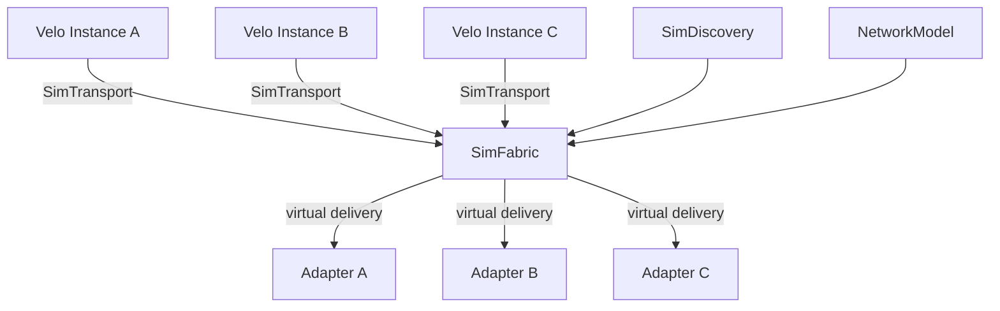

<!--
SPDX-FileCopyrightText: Copyright (c) 2025-2026 NVIDIA CORPORATION & AFFILIATES. All rights reserved.
SPDX-License-Identifier: Apache-2.0
-->

# velo-simulation

Discrete-event simulation transport for Velo.

## Overview

`velo-simulation` runs multiple Velo instances inside one process under virtual
time. Instead of opening real sockets, transports enqueue frames into a shared
`SimFabric`, which uses a pluggable `NetworkModel` to decide when transfers
complete.

This crate is intended for:

- Fast transport-level tests without real network setup
- Deterministic experiments with latency and contention
- End-to-end simulations that still exercise Velo transport, discovery, and
  shutdown behavior

## Core Types

- `SimFabric` owns all in-flight transfers, delivery scheduling, adapter
  registration, and discovery state
- `SimTransport` implements `velo_transports::Transport` on top of the shared
  fabric
- `SimDiscovery` implements `velo_discovery::PeerDiscovery` with in-memory
  lookups
- `NetworkModel` defines how transfers advance over virtual time and which one
  completes next
- `BisectionBandwidth` is the default model: per-link bandwidth sharing, global
  bisection cap, and fixed base latency

## Architecture



All participating instances share the same `Arc<SimFabric>`. The fabric updates
transfer progress whenever virtual time advances, reschedules completions when
contention changes, and delivers frames into each instance's
`TransportAdapter`.

## Network Model Contract

Custom models implement:

- `advance_to(&mut [Transfer], now)` to apply progress earned since the last
  virtual timestamp
- `next_completion(&[Transfer], now)` to pick the next completion event
- `is_complete(&Transfer, now)` so the fabric can retire one or more transfers
  at the current tick

`BisectionBandwidth` uses:

- Per `(source, target)` link sharing
- A fabric-wide `bisection_gbps` cap
- A one-time `base_latency` paid before payload bytes begin transferring

## Shutdown and Lifecycle

Simulation behavior mirrors the real transports closely enough for shutdown and
drain testing:

- New inbound `Message` frames are rejected during drain
- Rejections are surfaced back to the sender as `MessageType::ShuttingDown`
- `Response`, `Ack`, and `Event` frames continue to flow during drain
- Late delivery failures invoke the original `TransportErrorHandler`

Lifecycle helpers are available for tests and simulation harnesses:

- `SimFabric::unregister_adapter(instance_id)`
- `SimFabric::unregister_peer(instance_id)`
- `SimFabric::reset()`
- `SimDiscovery::unregister(instance_id)`
- `SimDiscovery::reset()`

`SimTransport::shutdown()` unregisters its adapter from the fabric.

## Example

```rust
use std::sync::Arc;
use std::time::Duration;

use loom_rs::sim::SimulationRuntime;
use velo_simulation::{BisectionBandwidth, SimDiscovery, SimFabric, SimTransport};

let mut sim = SimulationRuntime::new()?;
let handle = sim.handle();

let fabric = Arc::new(SimFabric::new(
    handle,
    BisectionBandwidth {
        link_gbps: 200.0,
        bisection_gbps: 12_800.0,
        base_latency: Duration::from_micros(10),
    },
));
let discovery = Arc::new(SimDiscovery::new(fabric.clone()));

let transport_a = Arc::new(SimTransport::new(fabric.clone()));
let transport_b = Arc::new(SimTransport::new(fabric.clone()));

// Build Velo instances with the simulated transport/discovery...
# let _ = (sim, discovery, transport_a, transport_b);
# Ok::<(), anyhow::Error>(())
```

Run the included example with:

```bash
cargo run -p velo-simulation --example sim_echo
```

## Notes and Limitations

- This is an in-process simulation, not a wall-clock network emulator
- All peers in a scenario must share the same `SimFabric`
- The model is deterministic for a fixed event schedule, but application logic
  can still introduce its own ordering choices
- `reset()` is intentionally destructive: it clears discovery state, adapters,
  and in-flight transfers and invalidates pending fabric callbacks
